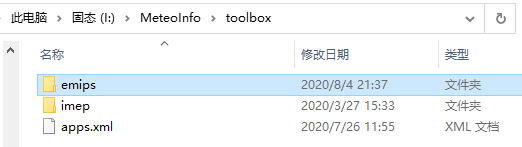
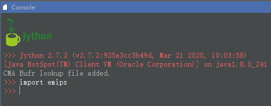

.. docs-emips-download:

**************************
Download and Run EMIPS
**************************

Download:
------------

Emission Inventory Processing System (EMIPS) could be downloaded freely from the website http://www.meteothink.org/downloads/index.html .

Add EMIPS toolbox:
----------------------

* Open the ``toolbox`` folder in the ``Meteoinfo`` directory and add the unzipped ``emips`` folder.

* Open the ``Meteoinfolab`` and type ``import emips`` in the Console form. If no error is reported, it means successful add emips toolbox.

