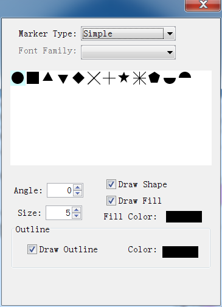
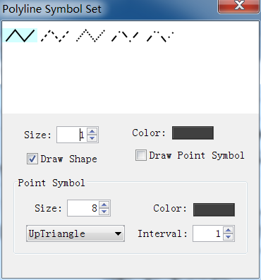

.. docs-meteoinfo-desktop-using_layers-legend_scheme:

************************
Legend Scheme
************************

The visualization behavior of a layer is base on its legend scheme. The legend scheme of the 
layer could be edited with ‘Legend’ option in layer property dialog.

.. image:: ../../../_static/meteoinfo/legend_open.png

Double click the colored rectangle under ‘Symbol’ column to open a ‘Symbol Set’ dialog.

.. image:: ../../../_static/meteoinfo/legend_polygonsymbol.png

Now change ‘Fill Color’ and press ‘Apply’ button in ‘Legend Set’ dialog, the color change is 
viewed in map window.

.. image:: ../../../_static/meteoinfo/legend_fillcolor.png

Point symbol setting dialog is showed bellow. The marker types are ‘Simple’, ‘Character’ and 
‘Image’.

.. image:: ../../../_static/meteoinfo/legend_pointsymbol_character.png
.. image:: ../../../_static/meteoinfo/legend_pointsymbol_image.png

Polyline symbol setting dialog is showed bellow.

There are three legend types in MeteoInfo.

- ‘SingleSymbol’. All shapes of the layer are set in one same symbol.
- ‘UniqueValue’. Each shape of the layer has its own symbol.
- ‘GraduatedColor’. The shapes are grouped according their values an each group has its own 
symbol.

For example, after you change the legend type to ‘Unique Value’ and select the ‘Field’ to 
‘CNTRY_NAME’. After press ‘Apply’ button, the map data will show as follow figure.

.. image:: ../../../_static/meteoinfo/legend_uniquevalue.png

The legend setting could be saved as a legend file with .lgs extension. And the legend file 
could be loaded also. Under ‘UniqueValue’ and ‘GraduatedColor’ types, some tools could be used 
to add/remove and move the break in the legend set. The legend changes will be saved to the 
layer only by pressing ‘OK’ button.
