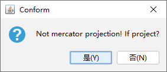
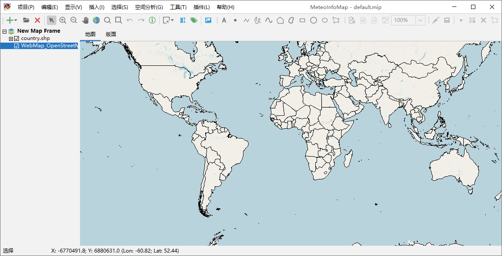
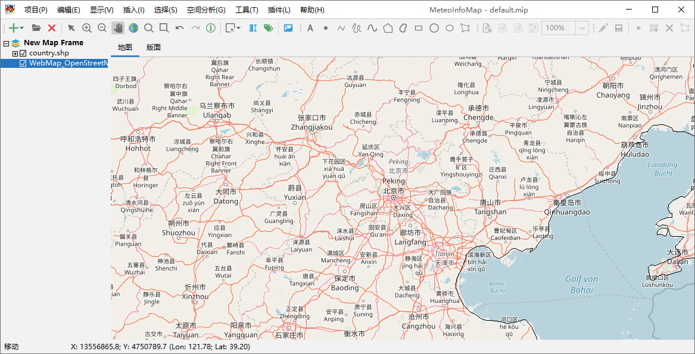
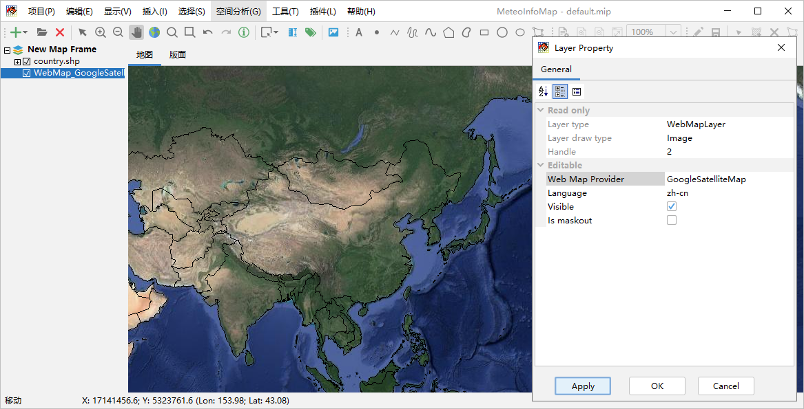

.. docs-meteoinfo-desktop_cn-map_layer-web_layer:

************************
网络地图图层
************************

MeteoInfo支持加载多种网络地图提供商的网络瓦片地图，这样可以大大丰富地理地图的显示（需要电脑能够访问互联网）。要加载
一个网络地图可以点击“添加图层”按钮右边的三角形，打开下拉菜单，选择“添加网络图层”菜单。网络地图是墨卡托（Mercator）
投影，如果当前地图框架不是墨卡托投影则会显示一个对话框问用户是否将地图框架投影为墨卡托投影，为了网络地图图层和其它图层
位置匹配，建议选“是”，这样就会增加一个网络地图图层。

.. image:: ./image/add_web_layer.png

新添加的网络地图图层缺省的地图提供方是OpenStreetMap，可以通过放大看到详细的网络地图信息。

除了OpenStreetMap之外MeteoInfoMap还支持很多其它网络地图提供方的网络地图，包括必应、雅虎、谷歌、高德、腾讯等。
双击网络地图图层名打开网络地图图层属性对话框。

.. image:: ./image/web_layer_property.png

可以通过选择网络地图提供方（Web Map Provider）来加载不同的网络地图，比如加载谷歌卫星网络地图。

