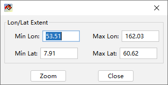

.. docs-meteoinfo-desktop_cn-mapview-map_zoom:

************************
地图漫游
************************

地图是活动地图框架图形显示的区域，显示的具体内容是有地图框架中各图层的显示设置决定的。MeteoInfoMap工具栏中有一些
图形缩放工具方便对图形进行漫游，包括“放大”、“缩小”、“移动”、“所有图层范围”、“选中图层范围”和“自定义范围”。其中移
动工具最为常用，选中该工具按钮后地图区域会出现手形光标，可以通过鼠标拖动进行地图漫游，也可以通过鼠标滚轮进行地图缩
放。点击“所有图层范围”按钮可以让地图范围缩放到所有图层的最大范围。在某个图层被选中后可以通过点击“选中图层范围”按钮
将地图缩放到该图层的空间范围。“自定义范围”按钮点击后出现自定义空间范围的对话框，可以对地图显示的范围进行自定义。

