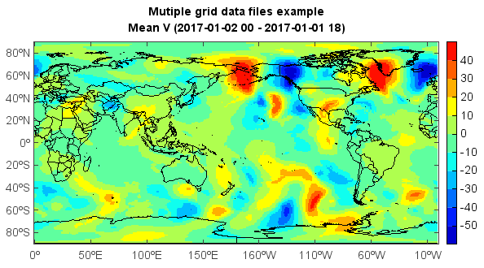

.. _docs-meteoinfolab-dataset-midata-addfiles:

*******************
addfiles
*******************

.. currentmodule:: mipylib.dataset.midata

.. function:: addfiles(fnames)

    Open multiple data files.
    
    :param fnames: (*list of string*) Data file names to be opened.
    
    :returns: (*DimDataFiles*) DimDataFiles object.
    
    Examples
    
    ::
    
        datadir = 'D:/Temp/grib'
        st = datetime.datetime(2017,1,1,0)
        et = datetime.datetime(2017,1,1,18)
        fns = []
        while st <= et:
            fn = os.path.join(datadir, 'fnl_' + st.strftime('%Y%m%d_%H') + \
                '_00.grib2')
            print fn
            fns.append(fn)
            st = st + datetime.timedelta(hours=6)

        fs = addfiles(fns)
        v = fs['v-component_of_wind_tropopause']
        data = v[:,:,:]
        ndata = mean(data, axis=0)

        #Plot
        axesm()
        lworld = shaperead('D:/Temp/map/country1.shp')
        geoshow(lworld, edgecolor='k')
        layer = imshowm(ndata)
        colorbar(layer)
        title('Mutiple grid data files example\nMean V (' + st.strftime('%Y-%m-%d %H') + ' - ' + \
            et.strftime('%Y-%m-%d %H') + ')')
            
