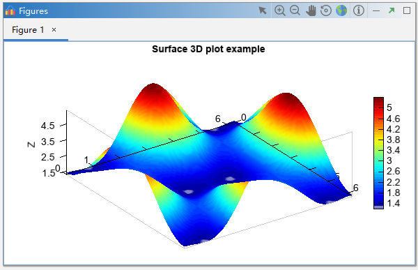

.. _dos-meteoinfolab-milab_cn-gui-figure:

***************************
图形
***************************

Console或Editor中的绘图语句运行后生成的图形会显示在图形栏（Figures）中，Figures中还有一些交互操作工具按钮，包括：
选择（Select）、放大（Zoom In）、缩小（Zoom Out）、移动（Pan）、旋转（Rotate）、复原（Full Extent）和提取信息
（Identifier）。Rotate工具只在三维图中有效，Identifier工具只在地图坐标系中有效。

