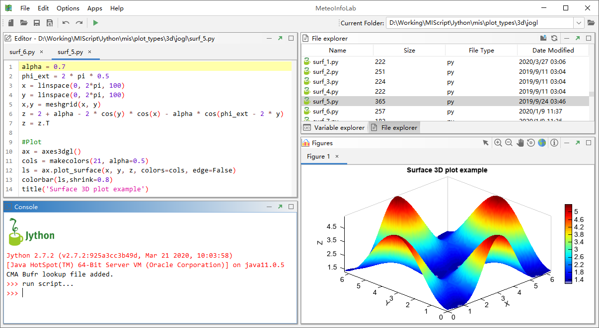
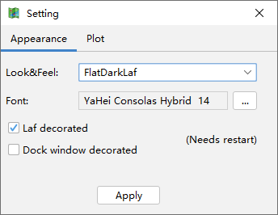
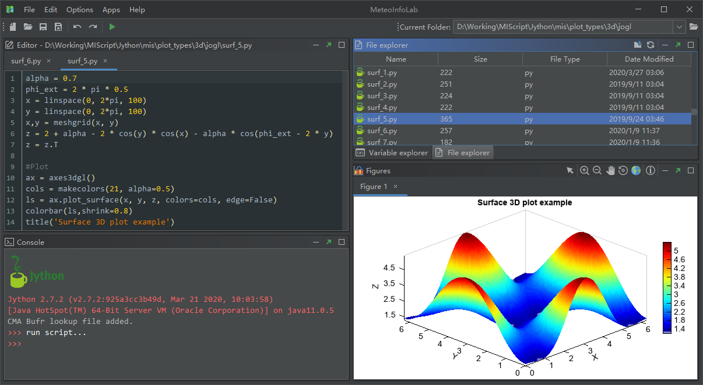

.. _dos-meteoinfolab-milab_cn-gui-main_gui:

***************************
MeteoInfoLab主界面
***************************

MeteoInfoLab启动后的主界面如下图所示，主要包括：菜单栏、工具栏、当前目录、代码编辑栏（Editor）、命令行栏（Console）、
图形栏（Figures）、文件浏览栏（File explorer）、变量浏览栏（Variable explorer）。

MeteoInfoLab的界面支持多种外观，点击“Options -> Setting”菜单打开设置对话框，Look&Feel选为FlatDarLaf软件界面
会转变为黑背景。

