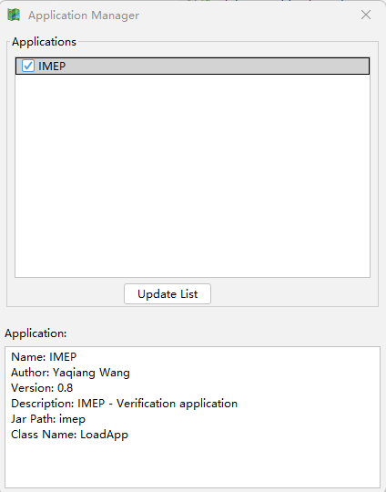

.. _dos-meteoinfolab-milab_cn-gui-toolbox:

***************************
工具箱应用
***************************

和MATLAB类似，MeteoInfoLab可以通过编写toolbox进行功能扩展。MeteoInfoLab主界面中有一个Apps菜单，软件启动时会
查找“MeteoInfo -> toolbox”目录中的子目录，每个子目录是一个toolbox，如果该toolbox有启动界面且有loadApp.py模
块，该模块中的LoadApp类继承了org.meteoinfo.plugin包中的PluginBase类，则该toolbox可以作为一个工具箱应用程序在
MeteoInfoLab中加载。点击“Apps -> Application Manager”菜单打开工具箱应用程序管理对话框，点击“Update List”按
钮扫描toolbox目录中可用的工具箱应用程序，勾选上之后该应用程序会出现在Apps菜单中。

