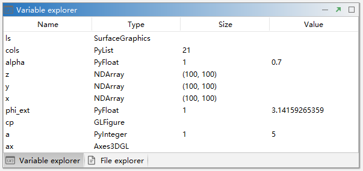

.. _dos-meteoinfolab-milab_cn-gui-variable_explorer:

***************************
变量浏览
***************************

通过运行Console代码或者Editor代码生成的变量可以在Variable explorer区域浏览，包括变量名（Name）、变量类型（Type）、
包含数据的大小（Size）、具体值（Value）。

