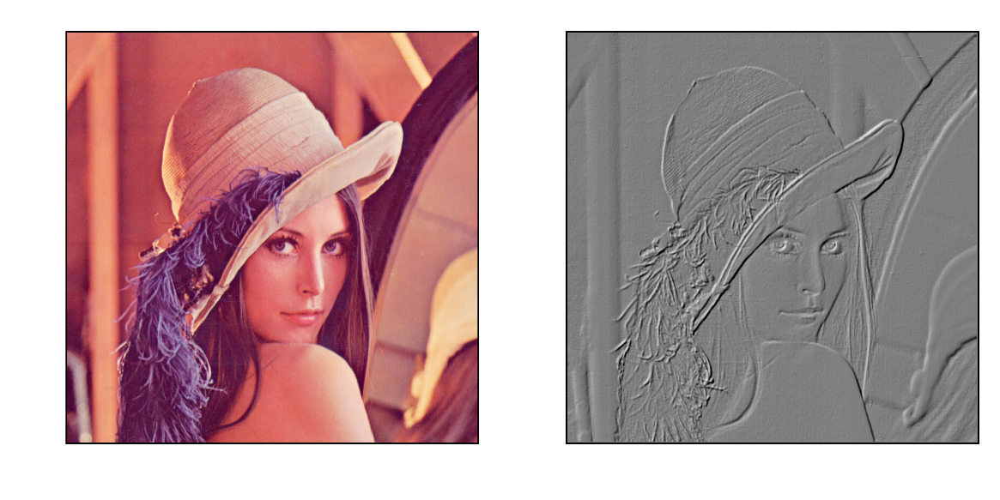

.. _dos-meteoinfolab-milab_cn-imagelib-introduction:

***************************
imagelib包简介
***************************

imagelib包中包含了图像文件的读写函数：imread和imwrite，分别从文件中读取RGB(A)数组和将RGB(A)数组写入图像文件。此外还包含
一些图像滤镜的功能，例如将图像通过emboss函数转换为浮雕效果。

::

    fn = os.path.join(migl.get_sample_folder(), 'image', 'Lenna.png')
    lena = imagelib.imread(fn)
    subplot(1, 2, 1,aspect='equal', tickline=False)
    imshow(lena)
    subplot(1, 2, 2, aspect='equal', tickline=False)
    lena_1 = imagelib.emboss(lena)
    imshow(lena_1)

