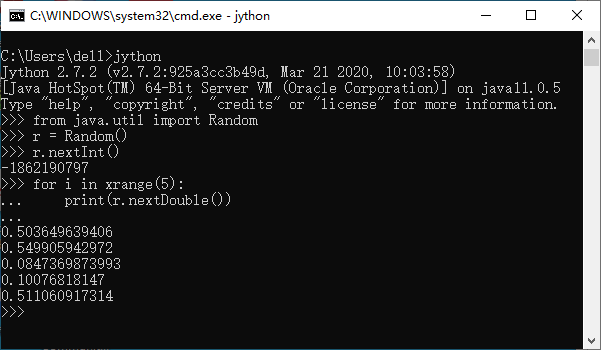

.. _dos-meteoinfolab-milab_cn-jython:

***************************
Jython 简介
***************************

要了解Jython首先要了解Python。Python是用C编写的高级的、面向对象的、开放源代码的编程语言。荷兰人Guido van Rossum
是Python的原创者，继而在Python的快速发展中产生了一大群高水平的设计者和程序员在不断开发和维护Python。作为一种动态类型
的胶水语言，Python可以很方便的使用C/C++和Fortran编写的库，因此尽管Python语言本身的运行效率比较低，通过底层低级语言的
扩展能够实现高效的数值运算，从而使Python成为数据科学和人工智能领域最流行的编程语言之一。Java编程语言具有面向对象、分布式、
健壮性、安全性、平台独立与可移植性、多线程、动态性等特点，作为长期非常流行的编程语言，积累了大量开源库和代码，Python的
Java实现也变得很有必要。Jython就是Python语言的Java实现。

Jython的历史要追溯到JimHugunin，他是Guidovan Rossum在国家研究动力中心（CNRI）的同事。JimHugunin认识到Python编程
语言用Java实现的重要性，并在1997年开始开发最初名为JPython的语言。1999年2月由当时也在CNRI的Barry Warsaw继续领导
JPython的开发并发布了JPython 1.1版本。2000年10月JPython项目转移到Sourceforge上成为一种更开放的语言模型，并改名为
Jython。在此期间，一个对Jython做了主要贡献的人FinnBock领导了Jython项目小组。正是由于FinnBock所做的杰出贡献使Jython
现在成为一个如此有价值的工具。后续的主要开发者包括Frank Wierzbicki、Finn、Samuele、Jeff Allen、Jim Baker等。
目前Jython的最新版本是2.7.3，可以在Jython网站上下载：https://www.jython.org。

Jython和同版本的Python语法完全相同，也包含了几乎所有Python标准库，但不支持Python中用C语言编写的扩展库，如Numpy、
Matplotlib等。在Jython里可以方便的导入和使用Java包，示例如下：

