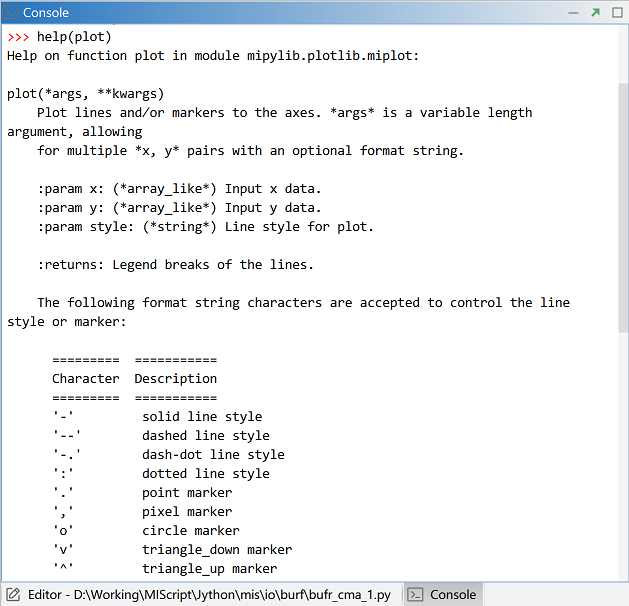

.. _dos-meteoinfolab-milab_cn-jython_packages-help:

***************************
获取函数帮助信息
***************************

MeteoInfoLab Jython包中的函数使用可以在Console里输入help(函数名)来获取帮助信息。mipylib包位于
“MeteoInfo -> pylib”目录中，包含了所有Jython源代码，在帮助文档信息不够的时候可以查看相关源代码帮助理解。

MeteoInfo网站上也有一些函数的帮助文档和示例程序，还在不断的完善中。网站上有搜索功能，在Quick search栏中输
入要搜索的内容也可能找到相关的帮助信息。