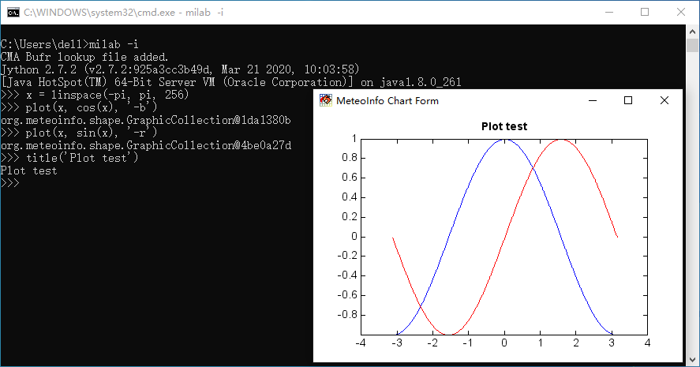

.. _dos-meteoinfolab-milab_cn-jython_packages-interactive_env:

*****************************
MeteoInfoLab命令行交互式环境
*****************************

在操作系统的命令行环境中可以输入 milab -i （Linux中用 milab.sh -i）可以进入MeteoInfoLab命令行交互式环境
（不启动MeteoInfoLab主界面）。MeteoInfo软件目录最好放入系统的PATH变量中。在命令行交互式环境中可以编写和运行
Jython代码，在此环境中MeteoInfoLab的Jython包也进行了预加载，可以直接使用相关函数。

