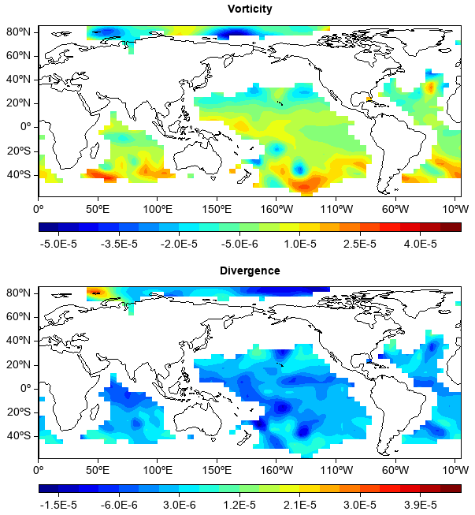

.. _dos-meteoinfolab-milab_cn-meteolib-introduction:

***************************
meteolib包简介
***************************

meteolib包中包含一些气象常用的数据分析函数，例如计算矢量场的涡度和散度、高度和气压的转换、eof分析等。meteolib的
vorticity和divergence函数分别用来计算矢量场的涡度和散度。

::

    fn = os.path.join(migl.get_sample_folder(), 'GrADS', 'model.ctl')
    f = addfile(fn)
    u = f['U'][0,0,:,:]
    v = f['V'][0,0,:,:]
    vort = meteolib.vorticity(u, v)
    divg = meteolib.divergence(u, v)

    subplot(2,1,1,axestype='map')
    geoshow('continent')
    contourf(vort, 20)
    title('Vorticity')
    colorbar(orientation='horizontal', aspect=50)
    subplot(2,1,2,axestype='map')
    geoshow('continent')
    contourf(divg, 20)
    title('Divergence')
    colorbar(orientation='horizontal', aspect=50)

