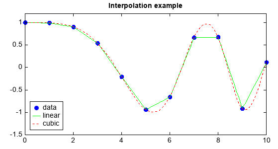
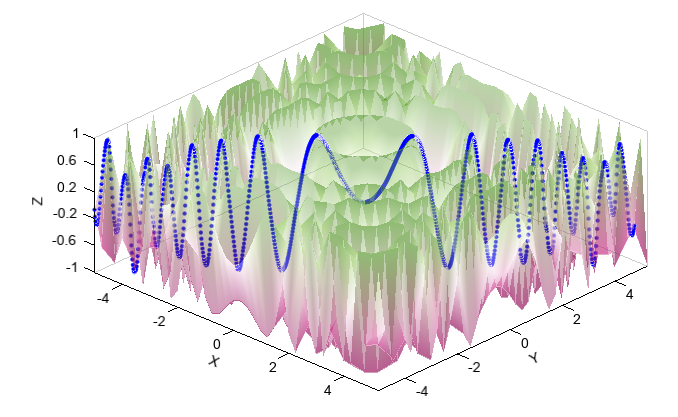
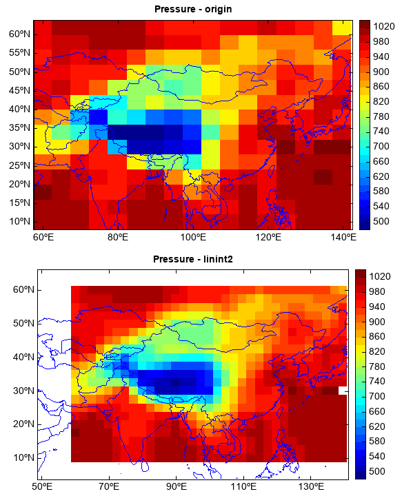
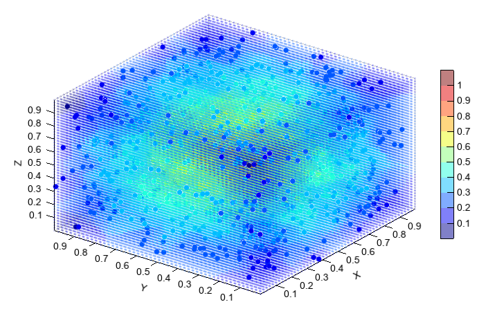

.. _dos-meteoinfolab-milab_cn-numeric-interpolate:

*****************************
插值分析（numeric.interpolate）
*****************************

numeric.interpolate包中包含了一维插值、二维插值和三维插值函数。一维插值可以通过Interp1d类来实现，初始化需要一维
数组x和y，还可以用kind参数指定插值方法。

::

    x = linspace(0, 10, num=11, endpoint=True)
    y = cos(-x**2/9.0)
    f = interpolate.interp1d(x, y)
    f2 = interpolate.interp1d(x, y, kind='cubic')

    xnew = linspace(0, 10, num=100, endpoint=True)
    plot(x, y, 'bo', xnew, f(xnew), 'g-', xnew, f2(xnew), 'r--')
    ylim(-1.5, 1.2)
    legend(['data','linear','cubic'], loc='lower left')
    title('Interpolation example')

二维插值可以用interp2d类，该类初始化时需要规则网格的x和y一维数组和对应的z值二维数组，kind参数可以设为`linear`或
`spline`。

::

    x = np.arange(-5.01, 5.25, 0.25)
    y = np.arange(-5.01, 5.25, 0.25)
    xx, yy = np.meshgrid(x, y)
    z = np.sin(xx**2+yy**2)
    f = interpolate.interp2d(x, y, z, kind='spline')

    xnew = np.arange(-5.01, 5.01, 1e-2)
    ynew = np.arange(-5.01, 5.01, 1e-2)
    znew = f(xnew, ynew)

    scatter3(xnew, ynew, znew, 4, c='b')
    surf(xx, yy, z, edge=False, cmap='MPL_PiYG', alpha=0.4)

二维双线性插值可以用`linint2`函数，常用于改变气象格点数据的分辨率。

::

    fn = os.path.join(migl.get_sample_folder(), 'GrADS', 'model.ctl')
    f = addfile(fn)
    ps = f['PS'][:]
    ps = ps[:,'10:60','60:140']
    lon = arange(50, 142, 2.5)
    lat = arange(5, 66, 2.5)

    #Interpolate
    nps = interpolate.linint2(ps.dimvalue(2), ps.dimvalue(1), ps, lon, lat)

    #Plot
    levs = arange(500, 1021, 20)
    subplot(2,1,1,axestype='map')
    geoshow('country', edgecolor=(0,0,255))
    imshow(ps[1,:,:], levs)
    title('Pressure - origin')
    colorbar()

    subplot(2,1,2,axestype='map')
    geoshow('country', edgecolor=(0,0,255))
    imshow(lon, lat, nps[1,:,:], levs)
    title('Pressure - linint2')
    colorbar()

三维插值可以用NearestNDInterpolator和IDWNDInterpolator类，分别使用最邻近值和反距离权方法进行插值。

::

    def func(x,y,z):
        return 0.5*(3)**(1./2)-((x-0.5)**2+(y-0.5)**2+(z-0.5)**2)**(1./2)
    x = random.rand(1000)
    y = random.rand(1000)
    z = random.rand(1000)
    v = func(x,y,z)

    f = interpolate.NearestNDInterpolator([x,y,z], v)

    gx = linspace(x.min(), x.max(), 50)
    gy = linspace(y.min(), y.max(), 50)
    gz = linspace(z.min(), z.max(), 50)
    xx,yy,zz = meshgrid(gx, gy, gz)
    gv = f([xx,yy,zz])

    levs = arange(0.1, 1.1, 0.1)
    scatter3(x, y, z, c=v, levels=levs)
    scatter3(xx, yy, zz, c=gv, s=2, levels=levs, alpha=0.5)
    colorbar()

