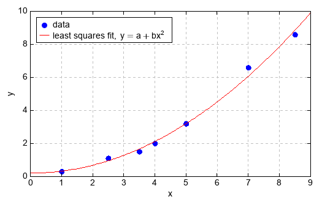

.. _dos-meteoinfolab-milab_cn-numeric-linalg:

***************************
线性代数（numeric.linalg）
***************************

numeric.linalg包中包含了一些基本的线性代数运算功能，底层用到了OpenBLAS库和一些纯Java数值运算库
（例如Apache Commons Math）。dot和vdot函数分别用来计算两个矩阵（即二维数组）和两个向量的乘积。

::

    >>> a = [[1, 0], [0, 1]]
    >>> b = [[4, 1], [2, 2]]
    >>> dot(a, b)
    array([[4, 1]
          [2, 2]])
    >>> a = array([1,4,5,6])
    >>> b = array([4,1,2,2])
    >>> vdot(a, b)
    30.0

inv函数计算矩阵的乘法逆矩阵。

::

    >>> a = array([[1., 2.], [3., 4.]])
    >>> ainv = linalg.inv(a)
    >>> ainv
    array([[-2.0000000000000004, 1.0000000000000004]
          [1.5, -0.5000000000000003]])
    >>> dot(ainv, a)
    array([[1.0000000000000009, 8.881784197001252E-16]
          [-8.881784197001252E-16, 0.9999999999999987]])

det函数计算输入矩阵的行列式。

::

    >>> a = array([[1,0,2,-1],[3,0,0,5],[2,1,4,-3],[1,0,5,0]])
    >>> linalg.det(a)
    30.0

矩阵分解的函数包括choleskey、qr、lu和svd，分别计算矩阵的Coleskey、QR、LU和奇异值分解。

::

    >>> a = array([[25,15,-5],[15,18,0],[-5,0,11]])
    >>> L = linalg.cholesky(a)
    >>> L
    array([[5.0, 0.0, 0.0]
          [3.0, 3.0, 0.0]
          [-1.0, 1.0, 3.0]])
    >>> dot(L, L.T)
    array([[25.0, 15.0, -5.0]
          [15.0, 18.0, 0.0]
          [-5.0, 0.0, 11.0]])

    >>> a = array([[12, -51,   4],[6, 167, -68],[-4,  24, -41]])
    >>> linalg.qr(a)
    (array([[-0.857142857142857, 0.3942857142857143, -0.3314285714285714]
          [-0.42857142857142855, -0.9028571428571428, 0.03428571428571431]
          [0.2857142857142857, -0.17142857142857143, -0.9428571428571428]]),
    array([[-14.0, -21.000000000000004, 14.0]
          [0.0, -175.0, 69.99999999999999]
          [0.0, 0.0, 35.0]]))

    >>> a = array([[1,2,3],[4,5,6],[3,-3,5]])
    >>> linalg.lu(a)
    (array([[0.0, 1.0, 0.0]
          [0.0, 0.0, 1.0]
          [1.0, 0.0, 0.0]]),
    array([[1.0, 0.0, 0.0]
          [0.75, 1.0, 0.0]
          [0.25, -0.1111111111111111, 1.0]]),
    array([[4.0, 5.0, 6.0]
          [0.0, -6.75, 0.5]
          [0.0, 0.0, 1.5555555555555556]]))

    >>> a = array([[1,2],[3,4],[5,6],[7,8]])
    >>> linalg.svd(a)
    (array([[0.15248323331020078, -0.8226474722256594, -0.3945010222838296, -0.3799591338775966]
          [0.3499183718079639, -0.4213752876845814, 0.24279654570435638, 0.800655879510063]
          [0.5473535103057269, -0.020103103143502922, 0.6979099754427761, -0.46143435738733596]
          [0.74478864880349, 0.38116908139757527, -0.5462054988633029, 0.040737611754869674]]),
    array([14.269095499261484, 0.6268282324175406]),
    array([[0.6414230279950724, 0.767187395072177]
          [0.767187395072177, -0.6414230279950724]]))

eig函数计算矩阵的特征值和特征向量。

::

    >>> a = diag((1,2,3))
    >>> a
    array([[1, 0, 0]
          [0, 2, 0]
          [0, 0, 3]])
    >>> linalg.eig(a)
    (array([1.0, 2.0, 3.0]), array([[1.0, 0.0, 0.0]
          [0.0, 1.0, 0.0]
          [0.0, 0.0, 1.0]]))

solve函数给出了矩阵形式的线性方程的解。

::

    >>> a = array([[3,1],[1,2]])
    >>> b = array([9,8])
    >>> linalg.solve(a, b)
    array([2.0, 3.0])

lstsq函数用来计算线性方程组的最小二乘解。下面的脚本程序计算出线性方程组的最小二乘解并绘图。

::

    x = array([1, 2.5, 3.5, 4, 5, 7, 8.5])
    y = array([0.3, 1.1, 1.5, 2.0, 3.2, 6.6, 8.6])
    M = ones((len(x),2))
    M[:,1] = x**2
    p, res = linalg.lstsq(M, y)
    print(p)

    #Plot
    plot(x, y, 'bo', label='data')
    xx = linspace(0, 9, 101)
    yy = p[0] + p[1]*xx**2
    plot(xx, yy, color='r', label='least squares fit, $y = a + bx^2$')
    xlabel('x')
    ylabel('y')
    legend(loc='upper left', facecolor='w')
    grid(alpha=0.25)

