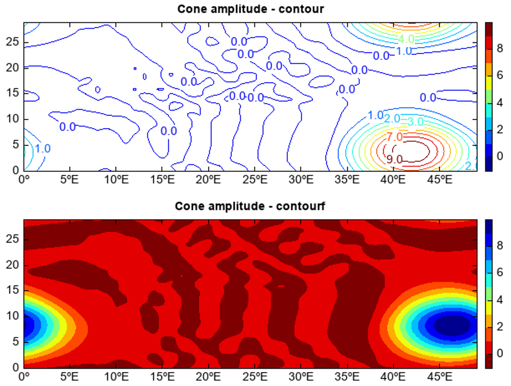
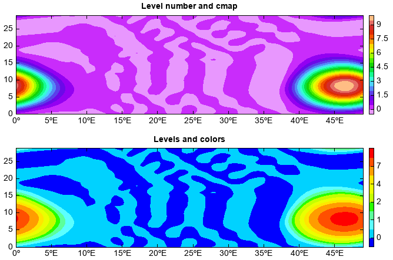

.. _dos-meteoinfolab-milab_cn-plotlib-contour_plot:

***************************
等值线图
***************************

等值线图是以相等数值点的连线表示连续分布且逐渐变化的数量特征的一种图型，在气象领域应用十分普遍，比如等温图、等压图、
降水等值线分布图等。contour函数用来绘制等值线，contourf函数用来绘制有颜色填充的等值线图。在等值线上标注其值的函数是clabel，
第一个参数是contour函数返回的等值线图形对象。缺省情况下软件会根据数据值的范围自动确定等值线层级的值，颜色会用缺省的颜色图
（cmap）matlab_jet和等值线层级数自动确定。colorbar函数用来绘制色阶的颜色栏。

::

    fn = os.path.join(migl.get_sample_folder(), 'NetCDF', 'cone.nc')
    f = addfile(fn)
    u = f['u'][4]
    subplot(2,1,1)
    cobj = contour(u)
    clabel(cobj, decimals=1)
    title('Cone amplitude - contour')
    colorbar()

    subplot(2,1,2)
    u = f['u'][5]
    contourf(u, cmapreverse=True)
    title('Cone amplitude - contourf')
    colorbar()

等值线的层级和颜色也可以自定义，数据变量后面紧跟的参数如果是整数则被当作等值线层级数，每个层级的值软件会根据数据情况自动设置，
cmap参数可以指定使用的颜色图。数据变量后面紧跟的参数如果是列表或者数组则被认为是等值线各层级的值，colors参数可以指定每个
等值线层级的颜色，如果是contourf绘制等值线填色图，则colors列表的长度要比等值线层级数多1。

::

    fn = os.path.join(migl.get_sample_folder(), 'NetCDF', 'cone.nc')
    f = addfile(fn)
    u = f['u'][5]

    subplot(2,1,1)
    contourf(u, 20, cmap='NCV_bright')
    title('Level number and cmap')
    colorbar()

    subplot(2,1,2)
    levs = [0,0.5,1,1.5,2,3,4,5,7,9]
    cols = makecolors(len(levs)+1, cmap='BlAqGrYeOrRe')
    contourf(u, levs, colors=cols)
    title('Levels and colors')
    colorbar()

