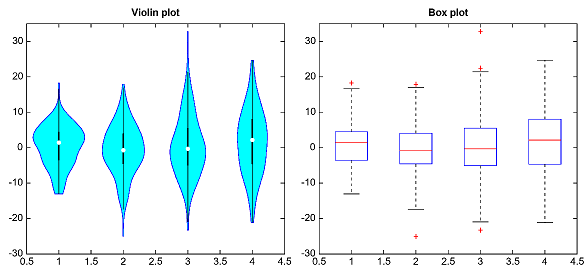
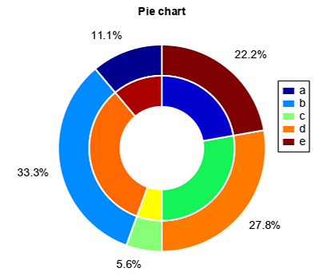

.. _dos-meteoinfolab-milab_cn-plotlib-distribution_plot:

***************************
数据分布图
***************************

表示数据分布情况的直方图可以用hist函数绘制，bins参数指定数据的分组数。

::

    x = random.randn(10000)
    hist(x, bins=50, color='c')
    title('Histogram')

箱线图是一种用作显示一组数据分散情况的统计图，能显示出一组数据的最大值、最小值、中位数、及上下四分位数。可以用boxplot函数绘制箱线图，
widths参数指定箱线图的宽度，showmeans参数指定是否绘制平均值点符号。

::

    data = []
    ave = []
    ss = 1000
    for i in range(6):
        random.seed(ss * (i + 1))
        a = random.randn(500)
        data.append(a)
        ave.append(a.mean())
    plot(arange(1, 7, 1), ave, '-g')
    boxplot(data, widths=0.3, showmeans=True)
    title('Box plot demo')

.. image:: ./image/plotlib_boxplot.png

boxplot函数还有一系列参数来指定箱线图各组成部分的细节特征，如参数boxprops、medianprops、meanprops、whiskerprops、
capprops、flierprops。

::

    data1 = []
    for i in range(6):
        data1.append(random.randn(500))
    data2 = []
    for i in range(6):
        data2.append(random.randn(500))
    pos1 = linspace(0.8, 5.8, len(data1))
    boxplot(data1, positions=pos1, widths=0.3, boxprops=dict(facecolor=None, edgecolor='b'),
        medianprops=dict(color='b'), meanprops=dict(color='b', marker='s'),
        whiskerprops=dict(color='b', linestyle='--'), capprops=dict(color='b'),
        flierprops=dict(color='b', marker='o'))
    pos2 = pos1 + 0.4
    boxplot(data1, positions=pos2, widths=0.3, boxprops=dict(facecolor=None, edgecolor='r'),
        medianprops=dict(color='r'), meanprops=dict(color='r', marker='s'),
        whiskerprops=dict(color='r', linestyle='--'), capprops=dict(color='r'),
        flierprops=dict(color='r', marker='o'))

    # draw temporary red and blue lines and use them to create a legend
    line1 = plot([-1], [-1], 'b-')
    line2 = plot([-1], [-1], 'r-')
    legend([line1, line2], ['A', 'B'])

    title('Box plot demo')
    xlim(0, 7)

.. image:: ./image/plotlib_boxplot_more.png

小提琴图 (Violin Plot) 用于显示数据分布及其概率密度，这种图表结合了箱形图和密度图的特征。violinplot函数用来绘制小提琴图，
widths参数指定小提琴图形的宽度，boxwidth指定小提琴区域最窄处的宽度。

::

    all_data = [np.random.normal(0, std, 100) for std in range(6, 10)]
    all_data[0][3] = nan

    fig,(ax1,ax2) = subplots(nrows=1,ncols=2)
    ax1.violinplot(all_data, widths=0.4, boxwidth=0.02)
    ax1.set_title('Violin plot')
    ax2.boxplot(all_data)

饼图主要用于展现不同类别数值相对于总数的占比情况，可以用pie函数绘制，explode参数可以指定某些扇区向外偏移，startangle参数指定饼图
起始扇区的角度，autopct参数指定每个扇区百分比标注的格式。

::

    x = [1, 3, 0.5, 2.5, 2]
    patchs, texts = pie(x, explode=[0,0.1,0,0.1,0], startangle=90, autopct='%.1f%%')
    title('Pie chart')
    legend(patchs, ['a','b','c','d','e'], loc='custom', x=0.75, y=0.5)

.. image:: ./image/plotlib_pie.png

可以用wedgeprops参数来绘制环状饼图，通过radius参数的控制能够绘制多个环状饼图的嵌套。

::

    x = [1, 3, 0.5, 2.5, 2]
    size = 0.3
    patchs, texts = pie(x, startangle=90, autopct='%.1f%%',
        wedgeprops=dict(edgecolor='w', linewidth=2, width=size))
    pie(x, startangle=90, radius=1-size, cmap='GMT_seis',
        wedgeprops=dict(edgecolor='w', linewidth=2, width=size))
    title('Pie chart')
    legend(patchs, ['a','b','c','d','e'], loc='custom', x=0.75, y=0.5)

