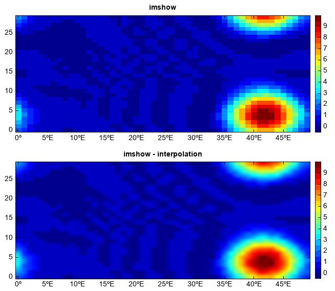
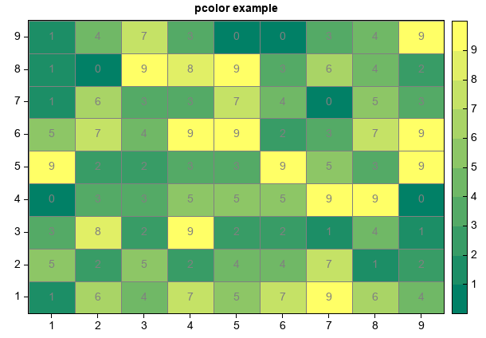

.. _dos-meteoinfolab-milab_cn-plotlib-image_plot:

*******************************
格点数据显示为图像和伪彩色图
*******************************

如果二维的格点数据在x、y维都是等间距的，可以用imshow函数将格点数据显示为图像，尤其对于格点数很多且分布很离散的数据用imshow
会比追踪等值线快很多，比如卫星遥感格点数据通常更适合用imshow函数显示为图像。色标层级的值和颜色的设置和contourf函数类似，
可以用interpolation函数来设置图像显示的插值方法。

::

    fn = os.path.join(migl.get_sample_folder(), 'NetCDF', 'cone.nc')
    f = addfile(fn)
    u = f['u'][4,:,:]

    subplot(2,1,1)
    imshow(u, 20)
    title('imshow')
    colorbar()

    subplot(2,1,2)
    imshow(u, 20, interpolation='bicubic')
    title('imshow - interpolation')
    colorbar()

对于规则和不规则网格，可以用pcolor函数绘制伪彩色图，会将每个网格当作一个多边形来绘制，对于复杂网格绘图速度会比较慢。

::

    x = arange(10) + 0.5
    y = arange(10) + 0.5
    x,y = meshgrid(x, y)
    z = random.randint(0, 10, (10,10))
    pcolor(x, y, z, edgecolor='gray', cmap='MPL_summer')
    colorbar()
    xaxis(tickin=False)
    xaxis(tickline=False, location='top')
    yaxis(tickin=False)
    yaxis(tickline=False, location='right')
    for xx, yy, zz in zip(x, y, z):
        text(xx+0.5, yy+0.5, str(zz), color='gray', xalign='center', yalign='center')
    title('pcolor example')

