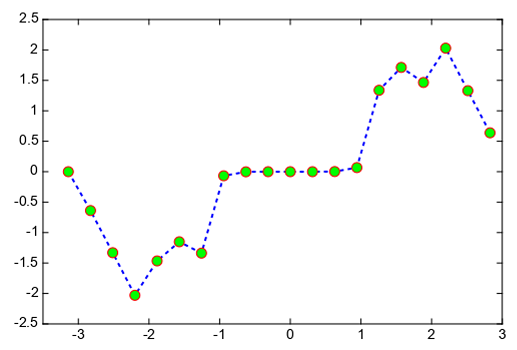

.. _dos-meteoinfolab-milab_cn-plotlib-line_plot:

***************************
线图
***************************

线图是最基本的图形之一，可以表达数据沿某个维的变化情况。plot函数可以方便的绘制x、y向量对应的线图，可以在一个plot函数中绘制
多组x、y向量的线图。

::

    x = linspace(-2*pi, 2*pi)
    y1 = sin(x)
    y2 = cos(x)

    plot(x, y1, x, y2)

.. image:: ./image/plotlib_plot.png

一对x、y之后可以用一个字符串指定线条的线型、颜色和标记。下面的例子绘制三条正弦曲线，每条曲线之间存在较小的相移。第一条正弦曲线使用
绿色线条，不带标记。第二条正弦曲线使用蓝色虚线，带圆形标记。第三条正弦曲线只使用青蓝色星号标记。

::

    x = arange(0, 2*pi, pi/10)
    y1 = sin(x)
    y2 = sin(x - 0.25)
    y3 = sin(x - 0.5)

    plot(x, y1, 'g', x, y2, 'b--o', x, y3, 'c*')

.. image:: ./image/plotlib_plot_linestyle.png

创建线图并指定带圆形标记的蓝虚线。使用linewidth、markersize、makeredgecolor和makerfacecolor指定线宽、标记大小、标记外框
线颜色和标记填充颜色。

::

    x = arange(-pi, pi, pi/10)
    y = tan(sin(x)) - sin(tan(x))

    plot(x,y,'--bo', linewidth=2, markersize=10, markeredgecolor='r',
        markerfacecolor='g')

xlim和ylim函数可以控制x坐标轴和y坐标轴的数值范围，xlabel和ylabel函数用来设置x和y坐标轴的标注，title函数设置图形的标题，
legend函数设置图形的图例。

::

    a = arange(0, 3, .02)
    b = arange(0, 3, .02)
    c = exp(a)
    d = c[::-1]

    plot(a, c, 'b--', a, d, 'b:', a, c + d, 'r')
    legend(('Model length', 'Data length', 'Total message length'),
           loc='upper center', shadow=True, facecolor=(204,255,204))
    xlim(0, 3)
    ylim(-1, 20)
    xlabel('Model complexity --->')
    ylabel('Message length --->')
    title('Minimum Message Length')

step函数可用绘制x、y向量数据对的阶梯图，其中where参数指定阶梯线的起始点。

::

    x = arange(1, 7, 0.4)
    y0 = sin(x)
    y = y0 + 2.5
    step(x, y, label='pre (default)', color='b', linewidth=2)
    y -= 0.5
    step(x, y, where='mid', label='mid', color='r', linewidth=2)
    y -= 0.5
    step(x, y, where='post', label='post', color='g', linewidth=2)
    legend(loc='lower left')
    xlim(0, 7)
    ylim(-0.5, 4)
    title('Step example')

.. image:: ./image/plotlib_step.png

errorbar函数用来绘制含误差棒的线图，误差棒可以是y方向的，也可以是x方向的。

::

    x = arange(0.1, 4, 0.5)
    y = exp(-x)
    # example error bar values that vary with x-position
    yerr = 0.1 + 0.2 * sqrt(x)
    xerr = 0.1 + yerr
    errorbar(x, y, yerr=[yerr, yerr*2], xerr=[xerr, xerr*2], fmt='b-o', ecolor=(0,153,51))
    title('Variable error bar values example')

两条线之间填充颜色可以用fill_between函数，需要x坐标向量和两个y向量代表两条线，还可以添加条件判断参数只对符合条件的区域
进行填色。fill_betweenx函数对两个x方向向量代表的两条线填充颜色。

::

    n = 256
    X = linspace(-pi, pi, n, endpoint=True)
    Y = sin(2*X)

    fill_between(X, Y+3, Y+2.5, color='g', edgecolor=None, alpha=.25)

    fill_between(X, 1, Y+1, color='blue', edgecolor='r', alpha=.25)

    fill_between(X, -1, Y-1, (Y-1) > -1, color='blue', alpha=.25)
    fill_between(X, -1, Y-1, (Y-1) < -1, color='red',  alpha=.25)
    xlim(-pi, pi)
    ylim(-2.5, 4.5)
    title('fill_between example')

对数坐标的图形绘制可以用loglog、semilogx和semilogy函数。loglog函数绘制的是双对数坐标图。

::

    x = [1,3,10]
    y = [1,9,100]
    loglog(x, y, 'r-o', label='loglog line')
    ylabel('Y Axis')
    xlabel('X Axis')
    xlim(1e-1, 1e2)
    ylim(1e-1, 1e3)
    legend()
    xaxis(minortick=True)
    yaxis(minortick=True)
    title('loglog example')

semilogx和semilogy分别绘制x轴和y轴为对数坐标的半对数坐标图。

::

    t = arange(0.01, 20.0, 0.01)
    subplot(2,1,1)
    semilogx(t, sin(2*pi*t), label='semilogx')
    grid(True)
    ylabel('Y Axis')
    xlabel('X Axis')
    legend()
    xaxis(minortick=True)
    yaxis(minortick=True)
    title('semilogx example')

    x = arange(0, 20.1, 1.0)
    y = exp(-x/5.0)
    subplot(2,1,2)
    semilogy(x, y, 'r-o', label='semilogy')
    grid(True)
    ylabel('Y Axis')
    xlabel('X Axis')
    legend()
    xlim(0,20)
    xaxis(minortick=True)
    yaxis(minortick=True)
    title('semilogy example')

.. image:: ./image/plotlib_semilogx_semilogy.png