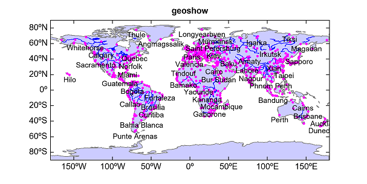
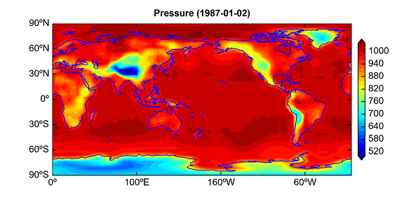
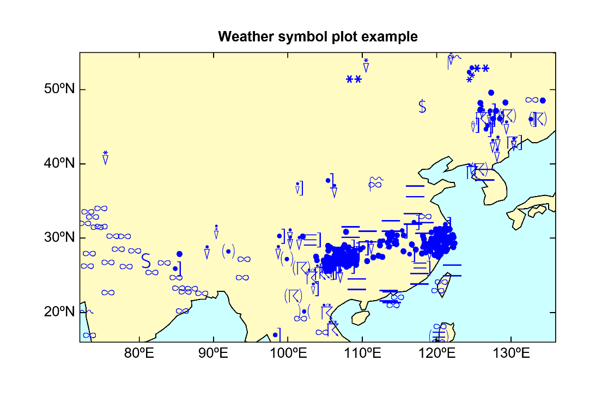
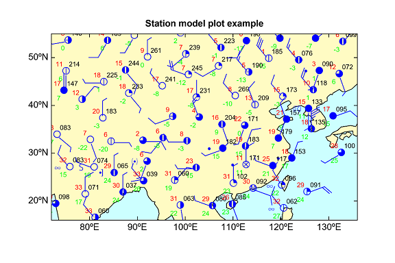
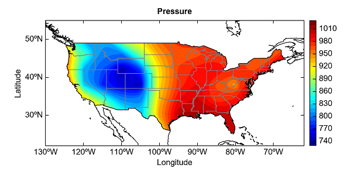
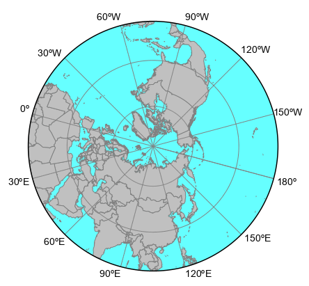
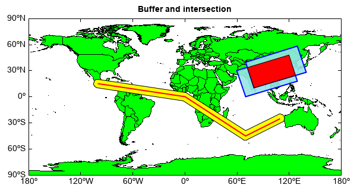

.. _dos-meteoinfolab-milab_cn-plotlib-map_axes:

*******************************
地图坐标系
*******************************

地图坐标系（MapAxes）是描述地理位置的二维坐标系，缺省二维坐标系分别为经度和纬度，经过地图投影后坐标系的单位通常为米（或者公里），
可以和经纬度进行相互换算。在地图坐标系中绘图需要先用axesm函数创建地图坐标系，然后用二维绘图函数在地图上绘制图形。地图坐标系中
通常要绘制地理底图作为专业图形信息的地理位置参考，geoshow函数可以用来绘制以Shapefile文件为代表的地理底图，如果之前没有axesm
创建地图坐标系，geoshow函数会自动创建一个地图坐标系。“MeteoInfo -> Map”目录中包含了一些Shapefile文件，geoshow
函数中第一个参数可以是其中某个Shapefile文件的文件名（无需.shp后缀），软件会自动在该目录中找到相应Shapefile文件并加载绘制其中
的地图数据图形。下面的例子用geoshow函数分别绘制了世界行政区域、主要河流和主要城市，geoshow函数返回地图图层对象，其addlabels
方法可以给图层中的地理要素添加标注。axis函数用来设置地图坐标系的经纬度范围，参数是一个列表，其中的要素分别是最小经度、最大经度、
最小纬度和最大纬度。

::

    axesm()
    geoshow('continent', facecolor=[204,204,255], edgecolor='gray')
    geoshow('rivers', color='b')
    cities = geoshow('cities', facecolor='m', edgecolor=None, size=4)
    cities.addlabels('NAME', fontsize=12, yoffset=-5)
    axis([-180, 180, -90, 90])
    title('geoshow')
    geoshow('continent', facecolor=[204,204,255], edgecolor='gray')
    geoshow('rivers', color='b')
    cities = geoshow('cities', facecolor='m', edgecolor=None, size=4)
    cities.addlabels('NAME', fontsize=12, yoffset=-5)
    axis([-180, 180, -90, 90])
    title('geoshow')

创建了地图坐标系后可以用相关绘图语句绘制图形。

::

    fn = os.path.join(migl.get_sample_folder(), 'GrADS', 'model.ctl')
    f = addfile(fn)
    ps = f['PS'][0]

    axesm()
    geoshow('coastline', color=(0,0,255))
    contourf(ps, 20, smooth=False)
    t = f.gettime(0)
    title('Pressure ({})'.format(t.strftime('%Y-%m-%d')))
    yticks(arange(-90, 91, 30))
    colorbar(extendrect=False, shrink=0.8, aspect=18)

站点观测中如果有天气现象数据（比如MICAPS第一类地面全要素观测数据），可以用weatherspec函数创建一个天气现象图例，然后在scatter
函数中将该图例赋给symbolspec参数，可以用天气现象数据绘制天气现象符号图。

::

    #Add file and read data array
    fn = os.path.join(migl.get_sample_folder(), 'MICAPS', '10101414.000')
    f = addfile_micaps(fn)
    data = f['WeatherNow'][:]
    lon = f['Longitude'][:]
    lat = f['Latitude'][:]
    #Plot
    axesm(bgcolor=(204,255,255))
    geoshow('continent', edgecolor='k', facecolor=(255,251,195))
    ls = weatherspec()
    layer = scatter(lon, lat, data, symbolspec=ls)
    yticks([20,30,40,50])
    title('Weather symbol plot example')
    xlim(72, 136)
    ylim(16, 55)

对于全要素地面气象观测数据还可以用stationmodel函数绘制站点填图。

::

    fn = os.path.join(migl.get_sample_folder(), 'MICAPS', '10101414.000')
    f = addfile_micaps(fn)
    data = f.smodeldata()

    #Plot
    axesm(facecolor=(204,255,255))
    geoshow('country', facecolor=(255,251,195))
    geoshow('cn_province', edgecolor='k')
    layer = stationmodel(data, size=14)
    yticks([20,30,40,50])
    title('Station model plot example')
    xlim(72, 136)
    ylim(16, 55)

    #Add south China Sea
    axesm(position=[0.11,0.12,0.18,0.24], bgcolor='w', axison=False)
    geoshow('cn_border', facecolor=(0,0,255))
    xlim(106, 123)
    ylim(2, 23)

气象数据可视化时经常会进行区域屏蔽（maskout），例如只绘制每个区域内部的数据图形。可以用geoshow函数将包含屏蔽区域的地图
数据文件加载到地图坐标系中（visible=False参数表示添加图层到地图坐标系，但不显示图层），在绘制专业图层后利用makslayer
函数来对专业图层内容进行屏蔽。

::

    fn = os.path.join(migl.get_sample_folder(), 'GrADS', 'model.ctl')
    f = addfile(fn)
    ps = f['PS'][0,'20:55','230:300']

    axesm()
    m_us = geoshow('us', visible=False)
    geoshow('us_states', edgecolor='gray')
    geoshow('country')
    layer = contourf(ps, 12)
    masklayer(m_us, [layer])
    title('Pressure')
    ylabel('Latitude')
    xlabel('Longitude')
    yticks([10,20,30,40,50])
    colorbar(layer)
    xlim(230, 298)
    ylim(22, 55)

地图坐标系会用到geolib包中的很多功能，比如读取地图数据文件的shaperead函数。geolib包中的地图投影功能可以对地图坐标系中的图形
进行投影变换。projinfo函数可以生成一个投影设置对象，参数包括投影名称、中央经度、中央纬度等，MeteoInfo的投影功能使用了Proj4j
库来实现，投影可以用投影字符串来定义，具体可以查阅PROJ项目的文档（https://proj.org）。下面的例子生成一个北极为中心点的
极射赤平投影，并定义在地图坐标系中，在geoshow函数添加地图数据时会自动进行投影变换，形成北极极射赤平投影地图图形。

::

    proj = geolib.Stereographic(central_latitude=90, central_longitude=105,
        cutoff=10)
    axesm(projection=proj, frameon=False, axison=False,
        boundaryprop={'facecolor':(102,255,255),'edgesize':1.5})
    grid(True, color='gray', tickvisible=True, tickposition='all')
    geoshow('country', facecolor='lightgray', edgecolor='gray')
    xticks(arange(0, 350, 30))
    axis()

利用geolib包中的拓扑模块可以进行一些地理空间分析，利用buffer函数分析空间要素的缓冲区，利用intersection函数分析两个多边形空间
要素的交集。

::

    import mipylib.geolib.topology as tp

    axesm()
    geoshow('country', edgecolor='k', facecolor='g')
    #Add line
    lat = [15, 0, -45, -25]
    lon = [-100, 0, 70, 110]
    line1 = geoshow(lat, lon, size=2, color='r')
    buf1 = tp.buffer(line1,5)
    geoshow(buf1, color='y')
    geoshow(lat, lon, size=2, color='r')
    #Add polygon
    lat = array([30, 0, 18, 48, 30])
    lon = array([60, 70, 130, 120, 60])
    g1 = geoshow(lat, lon, displaytype='polygon', color=[150,230,230,230], edgecolor='b', size=2)
    lat = lat + 10
    lon = lon + 10
    g2 = geoshow(lat, lon, displaytype='polygon', color=[150,230,230,230], edgecolor='b', size=2)
    g3 = tp.intersection(g1, g2)
    geoshow(g3, color='r')
    #Set extent
    xlim(-180, 180)
    ylim(-90, 90)
    xticks(arange(-180, 181, 30))
    yticks(arange(-90, 91, 30))
    title('Buffer and intersection')

