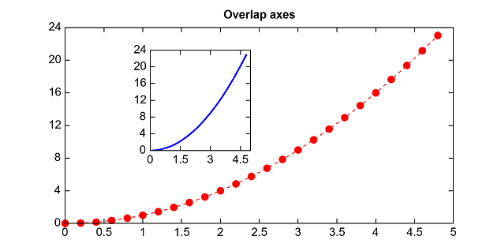
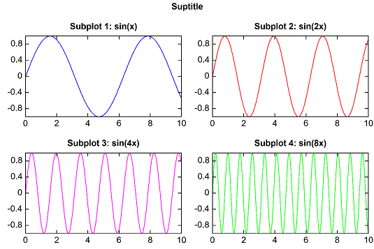

.. _dos-meteoinfolab-milab_cn-plotlib-multi_axes:

*******************************
多坐标系
*******************************

图形（Figure）中可以有多个坐标系（Axes），每个坐标系可以用position参数来控制其位置和大小。

::

    x = arange(0., 5., 0.2)
    y = x**2
    plot(x, y, 'r--o')
    title('Overlap axes')
    axes([0.3,0.4,0.2,0.4])
    plot(x, y, '-b', linewidth=2)

如果多个坐标系对齐排列，可以用subplot或者subplots函数生成坐标系。subplot函数中前两个参数是Y轴方向和X轴方向坐标系的个数，
第三个函数表示目前是第几个坐标系（从1开始）。下面的例子生成4个（2*2）整齐排列的坐标系。

::

    x = linspace(0, 10, 200)
    y1 = sin(x)
    y2 = sin(2 * x)
    y3 = sin(4 * x)
    y4 = sin(8 * x)

    subplot(2, 2, 1)
    plot(x, y1, color='b')
    title('Subplot 1: sin(x)')

    subplot(2, 2, 2)
    plot(x, y2, color='r')
    title('Subplot 2: sin(2x)')

    subplot(2, 2, 3)
    plot(x, y3, color='m')
    title('Subplot 3: sin(4x)')

    subplot(2, 2, 4)
    plot(x, y4, color='g')
    title('Subplot 4: sin(8x)')

    suptitle('Suptitle')

