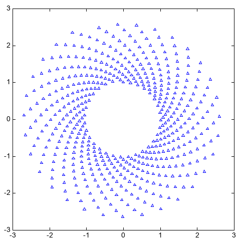
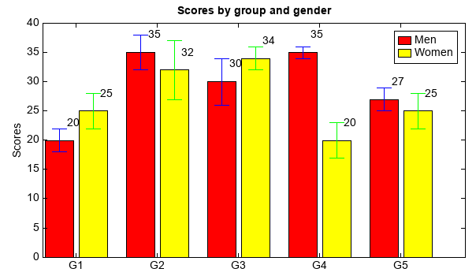
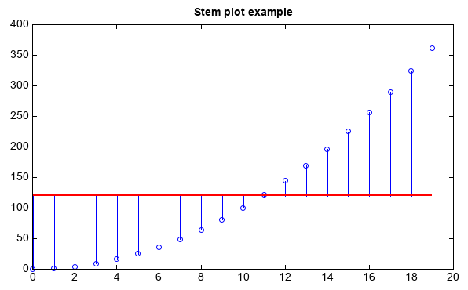

.. _dos-meteoinfolab-milab_cn-plotlib-scatter_plot:

***************************
离散数据图
***************************

scatter函数在向量 x 和 y 指定的位置创建一个散点图，该类型的图形也称为气泡图。可以通过s、marker、facecolor、edgecolor
等参数设置散点的大小、符号、填充颜色和边线颜色等。

::

    axes(aspect='equal')
    N = 500
    theta = linspace(0, 1, N)
    x = exp(theta)*sin(100*theta)
    y = exp(theta)*cos(100*theta)
    s = scatter(x, y, s=6, marker='^', facecolor=None, edgecolor='b')

bar(x, height, width, …)函数创建一个条形图，x向量指定条形图在x轴上的位置，height向量指定条形图y轴方向的高度，width
指定条形图的宽度。条形图上可以用yerr参数添加误差线。可以用过多个bar函数绘制多组数据。通过bottom参数可以指定条形图底部的位置，
多个bar函数绘制的条形图x轴位置相同，通过条形图底部位置控制可以绘制堆叠条形图。barh函数用法和bar类似，绘制的是水平条形图。

::

    menMeans = [20, 35, 30, 35, 27]
    std_men = (2, 3, 4, 1, 2)
    n = len(menMeans)
    ind = arange(n)
    width = 0.35
    gap = 0.06
    bar(ind, menMeans, width, yerr=std_men, color='r', ecolor='b', label='Men')
    for j in range(n):
        text(ind[j] + width / 4, menMeans[j] + 2, str(menMeans[j]))

    womenMeans = [25, 32, 34, 20, 25]
    std_women = (3, 5, 2, 3, 3)
    bar(ind + width + gap, womenMeans, width, yerr=std_women, color='y', ecolor='g', label='Women')
    for j in range(n):
        text(ind[j] + + width + gap + width / 4, womenMeans[j] + 2, str(womenMeans[j]))

    xlim(-0.2, 5)
    ylim(0, 40)
    ylabel('Scores')
    xticks(ind + width / 2 + gap / 2, ['G1','G2','G3','G4','G5'])
    legend()
    title('Scores by group and gender')

stem函数可以用来绘制x、y向量指定的针状图，可以用bottom参数指定针状图的基准线，y值小于bottom的向下绘制。

::

    x = arange(20)
    y = x**2
    stem(x, y, color='b', bottom=120, basefmt={'color':'r','size':2})
    title('Stem plot example')

