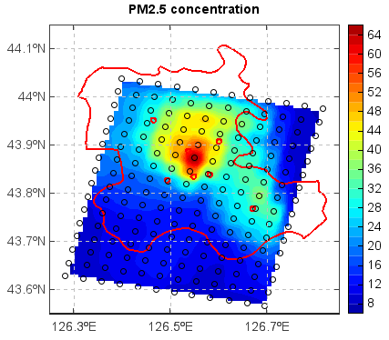

.. _docs-meteoinfolab-numeric-funcitons-griddata:

*******************
griddata
*******************

.. currentmodule:: mipylib.numeric.minum

.. function:: griddata(points, values, xi=None, **kwargs)

    Interpolate scattered data to grid data.
    
    :param points: (*list*) The list contains x and y coordinate arrays of the scattered data.
    :param values: (*array_like*) The scattered data array.
    :param xi: (*list*) The list contains x and y coordinate arrays of the grid data. Default is ``None``,
        the grid x and y coordinate size were both 500.
    :param method: (*string*) The interpolation method. [idw | cressman | neareast | inside | inside_min
        | inside_max | inside_count | surface]
    :param fill_value: (*float*) Fill value, Default is ``nan``.
    :param pointnum: (*int*) Only used for 'idw' method. The number of the points to be used for each grid
        value interpolation.
    :param radius: (*float*) Used for 'idw', 'cressman' and 'neareast' methods. The searching raduis. Default 
        is ``None`` in 'idw' method, means no raduis was used. Default is ``[10, 7, 4, 2, 1]`` in cressman 
        method.
    :param convexhull: (*boolean*) If the convexhull will be used to mask result grid data. Default is ``False``.
    
    :returns: (*array*) Interpolated grid data (2-D array)
    
    **Examples**
    
    ::
    
        f = addfile('D:/temp/nc/out.20140421_20140421_JL3KMmeic.nc')
        data = f['PM25']
        data = data[15,1,:,:]
        lon = f['lon'][:,:]
        lat = f['lat'][:,:]
        #Interpolate data to grid
        lon1 = linspace(lon.min(), lon.max(), lon.dimlen(1)*5)
        lat1 = linspace(lat.min(), lat.max(), lat.dimlen(0)*5)
        data1 = griddata((lon, lat), data, xi=(lon1, lat1), method='idw', convexhull=True)[0]
        lon_g,lat_g = meshgrid(lon1, lat1)
        #Plot
        axesm()
        mlayer = shaperead('D:/temp/map/jilin.shp')
        geoshow(mlayer, edgecolor='r', size=2)
        layer = contourfm(lon1, lat1, data1, 20)
        scatterm(lon, lat, data, 20, fill=False)
        colorbar(layer)
        xlim(126.25,126.85)
        ylim(43.55,44.15)
        grid(True)
        title('PM2.5 concentration')
        
