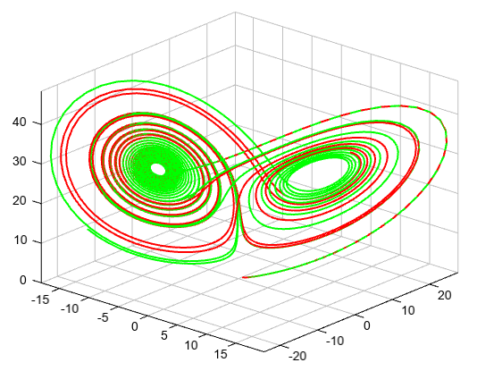

.. _docs-meteoinfolab-numeric-integrate-odeint:

*******************
odeint
*******************

.. currentmodule:: mipylib.numeric.integrate

.. function:: odeint(func, y0, t, args=())
    
    Integrate a system of ordinary differential equations.

    :param func: (callable(y, t, …) ) Computes the derivative of y at t.
    :param y0: (*array*) Initial condition on y (can be a vector).
    :param t: (*array*) A sequence of time points for which to solve for y. The initial value point should
        be the first element of this sequence.
    :param args: (*tuple*) Extra arguments to pass to function.
    :return: Array containing the value of y for each desired time in t.
    
The second order differential equation for the angle theta of a pendulum acted on by gravity with friction.
    
    ::
    
        from mipylib.numeric.integrate import odeint

        def pend(y, t, b, c):
            theta, omega = y
            dydt = [omega, -b*omega - c*np.sin(theta)]
            return dydt

        b = 0.25
        c = 5.0
        y0 = [pi - 0.1, 0.0]
        t = linspace(0, 10, 101)
        sol = odeint(pend, y0, t, args=(b, c))

        plot(t, sol[:, 0], 'b', label='theta(t)', linewidth=2)
        plot(t, sol[:, 1], 'g', label='omega(t)', linewidth=2)
        legend(loc='lower right')
        xlabel('t')
        grid()
        
.. image:: ../../../../_static/odeint_pendulum.png

Lorentz absorber.

    ::

        from mipylib.numeric import integrate

        def lorenz(p,t,s,r,b):
            x,y,z = p
            return s*(y-x), x*(r-z)-y, x*y-b*z   # dx/dt,dy/dt,dz/dt

        t = np.arange(0, 30, 0.01)
        track1 = integrate.odeint(lorenz, (0.0,1.00,0.0), t, args=(10.0,28.0,2.6))
        track2 = integrate.odeint(lorenz, (0.0,1.01,0.0), t, args=(10.0,28.0,2.6))

        axes3d()
        plot3(track1[:,0], track1[:,1], track1[:,2], linewidth=2, color='r')
        plot3(track2[:,0], track2[:,1], track2[:,2], linewidth=2, color='g')

