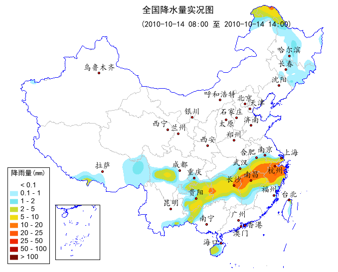

.. _docs-meteoinfolab-numeric-interpolate-griddata:

*******************
griddata
*******************

.. currentmodule:: mipylib.numeric.interpolate

.. function:: griddata(points, values, xi=None, **kwargs)

    Interpolate scattered data to grid data.
    
    :param points: (*list*) The list contains x and y coordinate arrays of the scattered data.
    :param values: (*array_like*) The scattered data array.
    :param xi: (*list*) The list contains x and y coordinate arrays of the grid data. Default is ``None``,
        the grid x and y coordinate size were both 500.
    :param method: (*string*) The interpolation method. [idw | cressman | nearest | inside_mean | inside_min
        | inside_max | inside_sum | inside_count | surface | barnes | kriging]
    :param fill_value: (*float*) Fill value, Default is ``nan``.
    :param pointnum: (*int*) Only used for 'idw' method. The number of the points to be used for each grid
        value interpolation.
    :param radius: (*float*) Used for 'idw', 'cressman' and 'neareast' methods. The searching raduis. Default 
        is ``None`` in 'idw' method, means no raduis was used. Default is ``[10, 7, 4, 2, 1]`` in cressman 
        method.
    :param convexhull: (*boolean*) If the convexhull will be used to mask result grid data. Default is ``False``.
    
    :returns: (*array*) Interpolated grid data (2-D array)
    
IDW method example
    
    ::
    
        f = addfile('D:/temp/nc/out.20140421_20140421_JL3KMmeic.nc')
        data = f['PM25']
        data = data[15,1,:,:]
        lon = f['lon'][:,:]
        lat = f['lat'][:,:]
        #Interpolate data to grid
        lon1 = linspace(lon.min(), lon.max(), lon.dimlen(1)*5)
        lat1 = linspace(lat.min(), lat.max(), lat.dimlen(0)*5)
        data1 = griddata((lon, lat), data, xi=(lon1, lat1), method='idw', convexhull=True)[0]
        lon_g,lat_g = meshgrid(lon1, lat1)
        #Plot
        axesm()
        mlayer = shaperead('D:/temp/map/jilin.shp')
        geoshow(mlayer, edgecolor='r', size=2)
        layer = contourfm(lon1, lat1, data1, 20)
        scatterm(lon, lat, data, 20, fill=False)
        colorbar(layer)
        xlim(126.25,126.85)
        ylim(43.55,44.15)
        grid(True)
        title('PM2.5 concentration')
        
.. image:: ../../../../_static/griddata_convexhull.png

Kriging method example

    ::

        fn = os.path.join(migl.get_sample_folder(), 'MICAPS', '10101414.000')
        f = addfile_micaps(fn)
        pr = f['Precipitation6h'][:]
        lon = f['Longitude'][:]
        lat = f['Latitude'][:]

        mask_rect = geolib.polygon([72,72,136,136], [16,55,55,16])
        pr,lon,lat = geolib.rmaskout(pr, lon, lat, mask_rect)
        idx = where(pr != nan)
        pr = pr[idx]
        lon = lon[idx]
        lat = lat[idx]

        #griddata function - interpolate
        x = arange(75, 135, 0.5)
        y = arange(18, 55, 0.5)
        prg = griddata((lon, lat), pr, xi=(x, y), method='kriging')[0]

        #Plot
        figure(figsize=[700,550], newfig=False)
        proj = projinfo(proj='lcc', lon_0=105, lat_1=25, lat_2=47)
        axesm(projinfo=proj, position=[0.01, 0.01, 0.99, 0.99], axison=False, gridlabel=False, frameon=False)
        geoshow('cn_province', edgecolor='lightgray')
        bou1_layer = geoshow('cn_border', facecolor=(0,0,255))
        city_layer = geoshow('cn_cities', facecolor='r', size=4)
        city_layer.addlabels('NAME', fontname=u'楷体', fontsize=16, yoffset=15, avoidcoll=False)
        china_layer = geoshow('china', visible=False)
        city_layer.movelabel(u'西宁', -15)
        city_layer.movelabel(u'海口', -20, -10)
        city_layer.movelabel(u'澳门', 0, -25)
        city_layer.movelabel(u'香港', 20, -10)
        city_layer.movelabel(u'福州', -10)
        city_layer.movelabel(u'合肥', -18)
        city_layer.movelabel(u'杭州', 0, -20)
        city_layer.movelabel(u'上海', 18)
        city_layer.movelabel(u'太原', 0, -20)
        city_layer.movelabel(u'天津', 15)
        city_layer.movelabel(u'石家庄', -10)
        levs = [0.1, 1, 2, 5, 10, 20, 25, 50, 100]
        cols = [(255,255,255),(170,240,255),(120,230,240),(200,220,50),(240,220,20),(255,120,10),(255,90,10), \
            (240,40,0),(180,10,0),(120,10,0)]
        layer = contourf(x, y, prg, levs, colors=cols)
        masklayer(china_layer, [layer])
        legend(layer, loc='lower left', frameon=True, title=u'降雨量(mm)', titlefontname=u'黑体')
        axism([79, 128, 14, 53])
        text(95, 53, u'全国降水量实况图', fontname=u'黑体', fontsize=18)
        text(95, 51, u'(2010-10-14 08:00 至 2010-10-14 14:00)', fontname=u'黑体', fontsize=16)

        #Add south China Sea
        sc_layer = bou1_layer.clone()
        axesm(position=[0.15,0.05,0.15,0.2], axison=False, frameon=True)
        geoshow(sc_layer, facecolor=(0,0,255))
        xlim(106, 123)
        ylim(2, 23)

