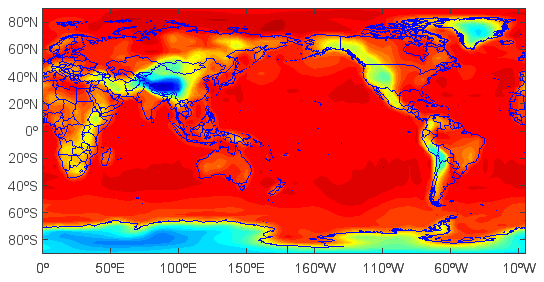
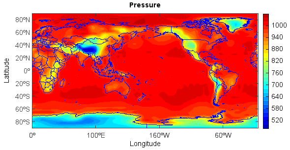
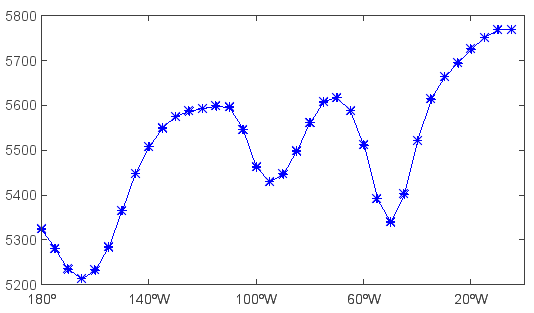
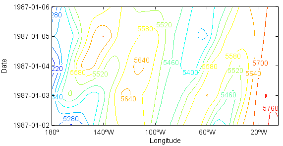
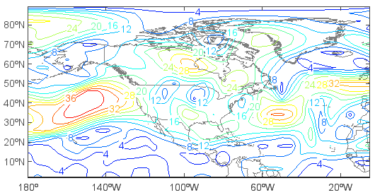
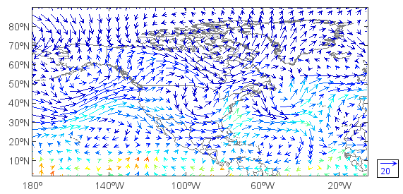
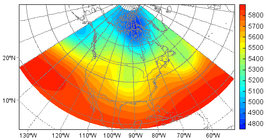

.. _docs-meteoinfolab-user_guid-data_tutorial:

*******************
Dataset tutorial
*******************

MeteoInfoLab supports many kinds of scientific data formats such as netCDF, HDF, GRIB, GrADS, ARL, MM5, MICAPS and so on. Unidata
netCDF Java library was used for reading netCDF, HDF and GRIB data formats. Most data formats file can be opened using ``addfile()``
function which return a MIDataFile object.  The path can be omitted if the data file was in the current folder::

    >>> f = addfile('model.ctl')
    
Query data file content including dimensions, attributes and variables by typing the data file 
variable::

    >>> f
    Title: 5 Days of Sample Model Output
    Descriptor: D:\Temp\grads\model.ctl
    Binary: D:\Temp\grads\model.dat
    Type = Gridded
    X Dimension: Xmin = 0.0; Xmax = 355.0; Xsize = 72; Xdelta = 5.0
    Y Dimension: Ymin = -90.0; Ymax = 90.0; Ysize = 46; Ydelta = 4.0
    Zsize = 7  Tsize = 5
    Number of Variables = 8
    PS 0 99 Surface
    U 7 99 U
    V 7 99 V
    Z 7 99 Geopotential
    T 7 99 Temperature
    Q 5 99 Specific
    TS 0 99 Surface
    P 0 99 Precipitation

Get data variable from data file variable::

    >>> v = f['PS']

``PS`` variable has 3 dimensions of time, latitude and longitude. Get 2 dimension data array from the data variable with slice
by fixing time dimension::

    >>> ps = v[0,:,:]
    >>> ps
    array([[670.15857, 670.15857, 670.15857, 670.15857, 670.15857, 670.15857, 670.15857, 670.15857, 670.15857, 670.15857, 670.15857, 
          670.15857, 670.15857, 670.15857, 670.15857, 670.15857, 670.15857, 670.15857, 670.15857, 670.15857, 670.15857, 670.15857, 
          670.15857, 670.15857, 670.15857, 670.15857, 670.15857, 670.15857, 670.15857, 670.15857, 670.15857, 670.15857, 670.15857, 
          670.15857, 670.15857, 670.15857, 670.15857, 670.15857, 670.15857, 670.15857, 670.15857, 670.15857, 670.15857, 670.15857, 
          670.15857, 670.15857, 670.15857, 670.15857, 670.15857, 670.15857, 670.15857, 670.15857, 670.15857, 670.15857, 670.15857, 
          670.15857, 670.15857, 670.15857, 670.15857, 670.15857, 670.15857, 670.15857, 670.15857, 670.15857, 670.15857, 670.15857, 
          670.15857, 670.15857, 670.15857, 670.15857, 670.15857, 670.15857]
          [689.02344, 681.99927, 675.3096, 668.8875, 663.1344, 657.78265, 652.89923, 648.5509, 645.2061, 642.93164, 641.7275, 641.5937, 
          642.4633, 644.13574, 646.4102, 648.95233, 651.82886, 654.50476, 656.9799, 659.0537, 660.8599, 662.1979, 663.0675, 663.66956, 
          664.1379, 664.7399, 665.8772, 667.81714, 671.0282, 675.77783, 682.6682, 691.0303, 700.931, 712.1028, 724.88, 737.5904, 
          749.89935, 761.53937, 772.24286, 781.6084, 788.3649, 792.91394, 795.12146, 794.6532, 791.6429, 786.6925, 780.27045, 772.8449, 
          764.9511, 758.1277, 752.5752, 748.829, 747.4242, 748.6283, 752.10693, 757.4587, 764.2153, 771.57385, 777.9291, 782.6787, 
          785.2208, 785.02014, 781.8091, 776.0559, 768.1621, 758.46216, 747.2904, 736.3862, 725.6159, 715.3807, 705.4131, 696.78345]
          [679.1896, 672.9682, 666.8137, 659.3882, 650.82544, 641.1254, 630.89026, 620.58813, 611.9585, 605.6033, 601.5226, 599.78326, 
          599.91705, 601.0543, 602.52606, 604.1985, 606.60675, 610.2192, 615.3033, 622.1268, 630.6895, 640.6571, 650.62476, 660.2579, 
          668.9544, 676.8482, 683.6717, 691.0303, 701.0648, 716.31726, 739.798, 769.7008, 805.69116, 844.7588, 884.5623, 917.2079, 
          941.49133, 958.1487, 968.25, 972.8659, 972.1969, 966.0425, 953.73346, 933.7983, 909.0465, 882.22095, 855.3285, 829.70703, 
          806.4939, 788.03046, 773.44696, 763.94763, 761.6063, 769.1656, 786.8263, 813.65186, 847.5685, ...]])

Plot map: create a map axes with axesm function; read shape file, view geodata layer::

    >>> axesm()    #Create a map axes
    (org.meteoinfo.chart.plot.MapPlot@c3d5957, +proj=longlat +lat_0=0 +lon_0=0 +lat_1=30 +lat_2=60 +lat_ts=0 +k=1 +x_0=0 +y_0=0 +h=0 )
    >>> mlayer = shaperead('D:/Temp/map/country1.shp')
    >>> geoshow(mlayer, edgecolor=(0,0,255))
  
.. image:: ../../../_static/tutorial_map.png

Create and plot filled contour layer from the dimension data array (20 is number of contour levels)::

    >>> layer = contourfm(ps, 20)
  

Add title, x and y labels and colorbar::

    >>> title('Pressure')
    >>> xlabel('Longitude')
    >>> ylabel('Latitude')
    >>> colorbar(layer)
  

Save figure::

    >>> savefig('D:/Temp/test/press.png', 400, 300)
    
Now try to get 0-D ``Z`` array (single value) along time dimension by fixing time, level, latitude and longitude dimensions::

    >>> hgt = f['Z'][0,[500],[40],[-90]]
    >>> hgt
    5759.111328125

Get 1-D ``Z`` array along longitude dimension and plot it::

    >>> hgt = f['Z'][0,[500],[40],[180,360]]
    >>> clf()             #Clear figure
    >>> plot(hgt)
    

Get and plot 2-D ``Z`` array with dimensions of latitude and longitude::

    >>> hgt = f['Z'][0,[500],[0,90],[180,360]]
    >>> clf()
    >>> axesm()
    (org.meteoinfo.chart.plot.MapPlot@c3d5957, +proj=longlat +lat_0=0 +lon_0=0 +lat_1=30 +lat_2=60 +lat_ts=0 +k=1 +x_0=0 +y_0=0 +h=0 )
    >>> geoshow(mlayer, edgecolor=(0,0,255))
    >>> layer = contourm(hgt)
    >>> clabel(layer)
    
.. image:: ../../../_static/tutorial_hgt_contourm.png

Get and plot 2-D ``T`` array with dimensions of level and latitude::

    >>> clf()
    >>> tair = f['T'][0,[1000,100],[-90,90],[270]]
    >>> u = f['U'][0,[1000,100],[-90,90],[270]]
    >>> lev1 = tair.dimvalue(0)    #Get level array
    >>> lev1
    array([1000.0, 850.0, 700.0, 500.0, 300.0, 200.0, 100.0])
    >>> lev2= p2h(lev1)    #Convert pressure to height
    >>> lev2
    array([118.82072662298948, 1458.904109589041, 3010.198878123406, 5574.761399787911, 9186.842105263158, 11818.421052631578, 16249.554367201426])
    >>> tair.setdimvalue(0, lev2)    #Set level dimension value to lev2 array
    >>> u.setdimvalue(0, lev2)
    >>> layer = contour(tair)
    >>> clabel(layer)
    >>> ulayer = contour(u)
    >>> clabel(ulayer)
    >>> yticks(lev2, lev1)
    >>> xlabel('Latitude')
    >>> ylabel('hPa')
    
.. image:: ../../../_static/tutorial_tair_contour.png

Another example, in this case with X and T varying (Hovmoller plot)::

    >>> clf()
    >>> hgt = f['Z'][0:4,[500],[40],[180,360]]
    >>> layer = contour(hgt, 10)
    >>> clabel(layer)
    >>> yaxis(axistype='time', timetickformat='yyy-MM-dd')
    >>> yticks(hgt.dimvalue(0))
    >>> xlabel('Longitude')
    >>> ylabel('Date')
    

Now that you know how to select the portion of the data set to view, we will move on to the topic of operations on the data. 
First, get 2-D ``TS`` array with latitude and longitude dimensions::

    >>> clf()
    >>> t = f['TS'][0,[500],[0,90],[180,360]]
    
Now say that we want to see the temperature in Fahrenheit instead of Kelvin. We can do the conversion by entering::

    >>> t = (ts-273.16)*9/5+32

Any expression may be entered that involves the standard operators of +, -, *, and /, and which involves operands which may be 
constants, variables, or functions. An example involving functions::

    >>> u = f['U'][0,[500],[0,90],[180,360]]
    >>> v = f['V'][0,[500],[0,90],[180,360]]
    >>> ws = sqrt(u*u+v*v)
    
to calculate the magnitude of the wind. A function is provided to do this calculation directly::

    >>> ws = magnitude(u, v)
    >>> axesm()
    (org.meteoinfo.chart.plot.MapPlot@c3d5957, +proj=longlat +lat_0=0 +lon_0=0 +lat_1=30 +lat_2=60 +lat_ts=0 +k=1 +x_0=0 +y_0=0 +h=0 )
    >>> geoshow(mlayer, edgecolor='gray')
    >>> layer = contourm(ws)
    >>> clabel(layer)    
    

View wind vectors::

    >>> cll()    #Clear last added layer
    >>> quiverm(u, v)    #Plot wind vector
    
Here we are displaying two expressions, the first for the U component of the vector; the 2nd the V component of the vector. We can 
also colorize the vectors by specifying a 3rd field::

    >>> cll()
    >>> q = f['Q'][0,[500],[0,90],[180,360]]
    >>> layer = quiverm(u, v, q)
    >>> quiverkey(layer, 0.94, 0.18, 20, bbox={'edge':True, 'fill':True})    #Plot wind vector key
    

To alter the projection::

    >>> clf()
    >>> axesm(proj='stere', lat_0=90, lon_0=-92, gridline=True)
    (org.meteoinfo.chart.plot.MapPlot@bf0b58a, +proj=stere +lat_0=90 +lon_0=-92 +lat_1=30 +lat_2=60 +lat_ts=0 +k=1 +x_0=0 +y_0=0 +h=0 )
    >>> geoshow(mlayer, edgecolor='gray')
    >>> hgt = f['Z'][0,[500],[15,80],[210,320]]
    >>> layer = contourfm(hgt, 20)
    >>> colorbar(layer)
    
