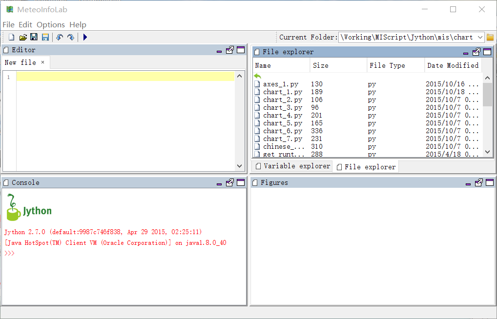
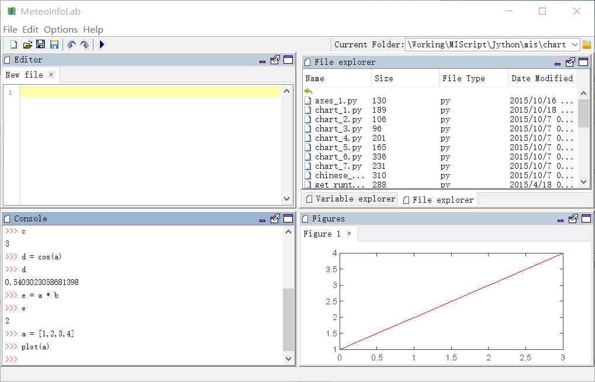
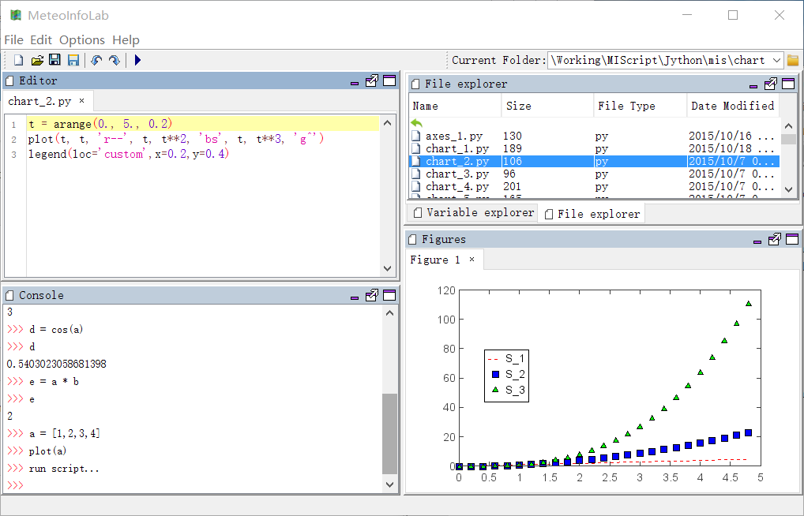

.. _docs-meteoinfolab-user_guid-gui:

*******************
MeteoInfoLab GUI
*******************

When you start MeteoInfoLab, the desktop appears in its default layout.
    

The desktop includes these panels:

* Current Folder (File explorer) -> Acess your files.
* Console -> Enter commands at the command line, indicated by the prompt (>>>).
* Editor -> Script program editor.
* Variable explorer -> Explore created variables.
* Figures -> Display created figures

As you work in MeteoInfoLab, you issue commands that create variables and call funcitons. For
example, create two variables named ``a`` and ``b`` by typing this statement at the command line:

::

    >>> a = 1
    >>> b = 2
    
Then create ``c`` variable by adding ``a`` and ``b``. The variable value can be printed by typing
variable name:

::

    >>> c = a + b
    >>> c
    3
    
And try other functions:

::

    >>> d = cos(a)
    >>> d
    0.5403023058681398
    >>> e = a * b
    >>> e
    2
    
You can recall previous commands by pressing the up- and down-arrow key. 

You can create and show a figure in figures panel by using plot related commands:

::

    >>> a = [1,2,3,4]
    >>> plot(a)

Also you can write a script program in editor panel and run it by clicking ``Run Script`` button
in toolbar.

