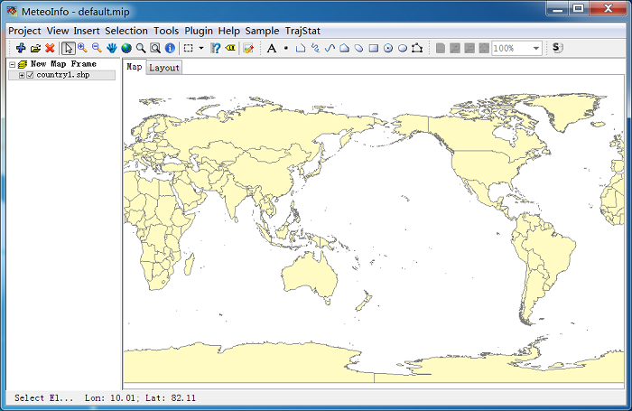

.. docs-meteoinfo-desktop-using_layers-add_layer:

************************
Add Layer
************************

Press ‘Add Layer’ button and select a supported map data file to open it.

In this case, we select to open ‘country1.shp’ file. ‘country1.shp’ is a polygon shape file, so 
it is opened as a colored map. The default color is light yellow.

Double click the layer name of ‘country1.shp’ to open its ‘Layer Property’ dialog to change the 
layer's apperance. 

Vector layer properties:

.. image:: ../../../_static/meteoinfo/layerproperty_vectorlayer.png

Image layer properties:

.. image:: ../../../_static/meteoinfo/layerproperty_imagelayer.png

Raster layer properties:

.. image:: ../../../_static/meteoinfo/layerproperty_rasterlayer.png

Web map layer properties:

.. image:: ../../../_static/meteoinfo/layerproperty_webmaplayer.png