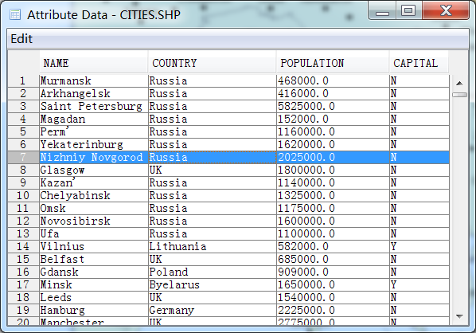

.. docs-meteoinfo-desktop-attr_table:

************************
Attribute Table
************************

The vector layer has attribute data. One row data in the attribute table corresponds with one shape of the layer. 
The attribute data of a shape which is highlighted could be identified using ‘Identifer’ tool button.

.. image:: ../../../_static/meteoinfo/attribute_identifer.png

The shapes could be labeled by the attribute data with ‘Label’ tool.

.. image:: ../../../_static/meteoinfo/attribute_label.png

The attribute data table could be opened by ‘Attribute Data’ menu.

