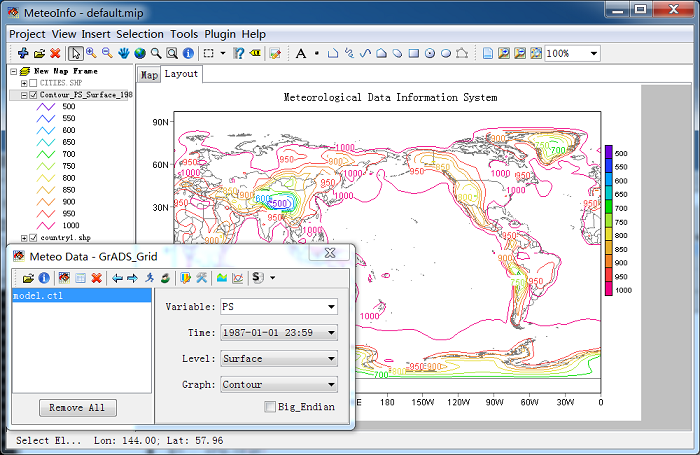
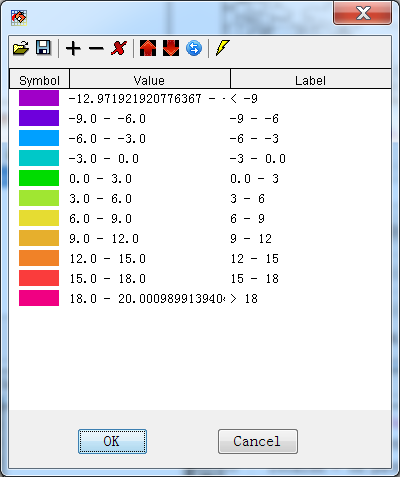
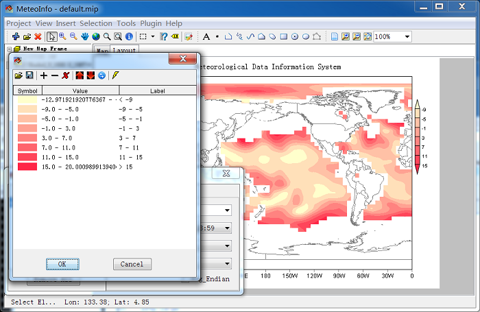

.. docs-meteoinfo-desktop-using_meteo_data-grid_data-contour_shaded:

************************
Contour and Shaded
************************

Set ‘Time’, ‘Level’, ‘Var’ items and select ‘Draw Type’ to ‘Contour’, and then click ‘Draw Data’ 
button. The software will trace the contour lines from the gridded data according to the setting. 
A layer was created including all the drawing shapes, and was added in ‘Layers’ window. The layer 
name was set automatically with draw type, various, level and time.

Shaded graphic is similar with contour graphic but with color filled.

.. image:: ../../../_static/meteoinfo/grid_shaded.png

The contour values will be calculated automatically by the software and the colors will be set 
as ‘Rainbow’ by default. The legend setting could be edited in ‘Legend Set’ dialog which could 
be opened by clicking ‘Legend Setting’ button.

This ‘Legend Set’ dialog is similar with the one described in map data section. But here when 
the legend setting changed and applied, the contour or shaded shapes will be calculated over 
again. And the legend type can not be changed here. The legend setting could be edited manually. 
And a ‘Legend Breaks’ automatically setting tool was applied also. Open it with ‘New Legend or 
Color’ button.

.. image:: ../../../_static/meteoinfo/legend_breaks.png

Change the interval to 4 and the color set to ‘Shade Color’ (the colors will be created from 
start color to end color). Then click ‘New Legend’ button. And then press ‘Apply’ button in 
‘Legend Set’ dialog. The changed only could be saved after you click ‘OK’ button.

