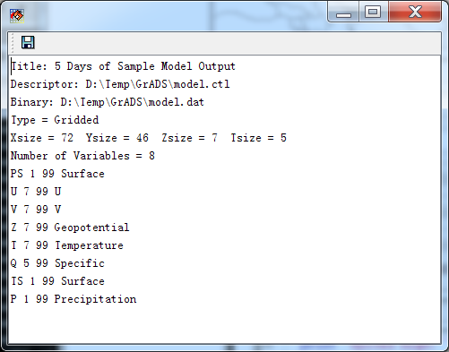

.. docs-meteoinfo-desktop-using_meteo_data-open_meteo_data:

************************
Open Meteorological Data
************************

‘Meteorological Data’ dialog is opened when MeteoInfo is started. Press ‘Open Data’ button in main
GUI will reopen the dialog if it is closed. 

.. image:: ../../../_static/meteoinfo/openmeteo_dialog.png

The supported meteorological data formats were listed under ‘Open Data’ button. Click one of 
them and select one meteorological data file. Some data information will be showed such as 
times, variables and levels.

.. image:: ../../../_static/meteoinfo/openmeteo_opendata.png

The more detailed information of the data could be viewed by pressing ‘Show Data Information’ 
button.

