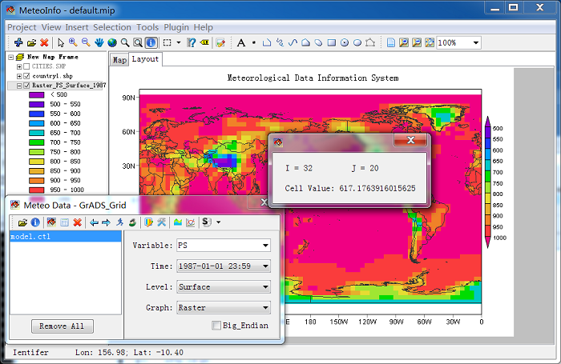

.. docs-meteoinfo-desktop-using_meteo_data-grid_data-raster:

************************
Raster
************************

Raster option is much faster than the others for a grid data with a large number of cells. 
The data value of each cell can be identified by ‘Identifer’ tool.

