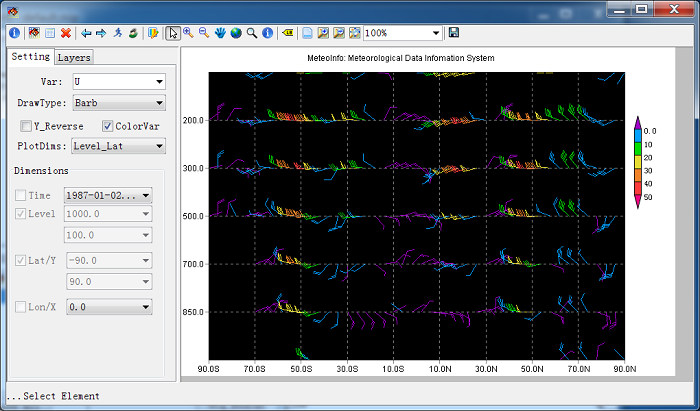

.. docs-meteoinfo-desktop-using_meteo_data-section_plot:

************************
Section Plot
************************

Click ‘Section Plot’ button to open ‘Section Plot’ window. Select ‘Var’, ‘DrawType’ and 
‘PlotDims’ and set the dimensions and then press ‘Draw Data’ button, section plot will be 
plotted. For this kind of plot, there are two variable dimensions.

.. image:: ../../../_static/meteoinfo/sectionplot_shaded.png

Wind profile plot.

