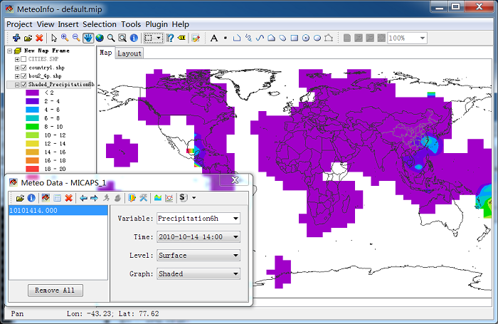
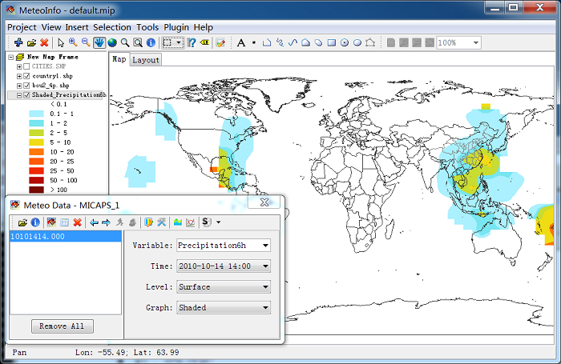

.. docs-meteoinfo-desktop-using_meteo_data-station_data-station_contour:

************************
Contour and Shaded
************************

To draw the contour or shaded graphics, the station data have to be interpolated to grid data. 
The software will set the interpolation parameters automatically. The automatic setting is not 
good in this case, so we should change the setting.

After legend was reset, the graphic looks as following picture. It is much better, but maybe you 
still don’t like it. Then you could change the interpolation setting to see what will happen.

Click ‘Setting’ button in ‘Meteorological Data’ dialog to open ‘Interpolate’ dialog. In which 
output grid and interpolation method can be set. IDW (Inverse Distance Weighted) and Cressman 
analysis methods are applied at present. IDW includes IDW_Radius and IDW_Neighbors options. With 
IDW_Radius, the grid point without station point found in radius will be set as undefined 
(which will not be used in contour tracing process). With IDW_Neighbors option, all grid points 
will have values calculated from the nearest station points. The continuous distributed 
variables such as temperature may suite for IDW_Neighbors option. In this case, we first select 
interpolation method as IDW_Radius.

.. image:: ../../../_static/meteoinfo/interpolate_open.png

After you changed the setting, press ‘OK’ button to save the setting and the ‘Interpolate’ 
dialog will be closed also. Then press ‘Draw Data’ button in ‘Meteorological Data’ to redraw 
the figure with new setting. If you set ‘XSize’ and ‘YSize’ to 1, and ‘Radius’ to 2, you could 
get following picture. With small ‘XSize’ and ‘YSize’ means much more grid points have to be 
interpolated, so much more time will be cost for it.

.. image:: ../../../_static/meteoinfo/interpolate_idwradius.png

If you just want to see the data in a certain area, such as China, you could change the output 
grid extent.

.. image:: ../../../_static/meteoinfo/station_shaded_idw.png

The Cressman objective analysis scheme (Cressman, 1959) is known as the successive correction 
method. It achieves its result by forcing convergence of the data to observed, interpolated 
values using multiple iterations. The example Cressman analysis result is plotted below.

.. image:: ../../../_static/meteoinfo/station_shaded_cressman.png