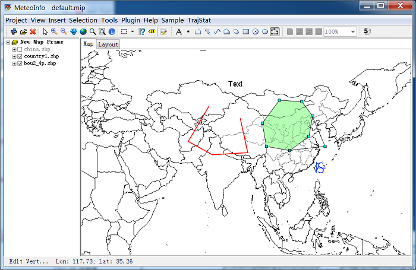
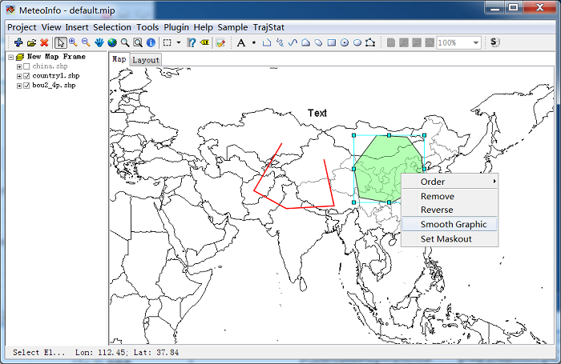

.. docs-meteoinfo-desktop-map_layout-user_plot:

************************
User Plot Tools
************************

You can draw label, point, polyline, polygon and rectangle both in ‘Map’ and ‘Layout’ plotting 
regions. The user plotting objects have same coordinates with the map, and the objects will be 
moved or re-projected synchronously with the map. The objects plotted on the layout have fixed 
coordinates which not changed with map view extent. 

Press one of the tool buttons on the user plotting tool strip, then you can plot label or 
geometry objects on map or layout. Label or point object can be plotted by clicking left mouse 
button in the map or layout plotting regions with the label or point tool selected. For drawing 
polyline or polygon object, the end points can be added by clicking left mouse button, and the 
object will be finished by double clicking left mouse button. The objects can be selected by 
clicking left mouse button using ‘Select Elements’ tool  , then the objects can be moved and 
resized, or be removed by pressing ‘Delete’ button on the keyboard. The properties of the object 
can be edited through the property dialog by double clicking the object.

.. image:: ../../../_static/meteoinfo/userplot_point.png

.. image:: ../../../_static/meteoinfo/userplot_point_character.png

The end points of the polyline or polygon can be moved using ‘Edit Vertices’ tool when the 
object is selected.

Polyline or polygon object can be smoothed using the ‘Smooth Graphic’ context menu viewed by 
clicking right mouse button.

.. image:: ../../../_static/meteoinfo/userplot_smooth_after.png