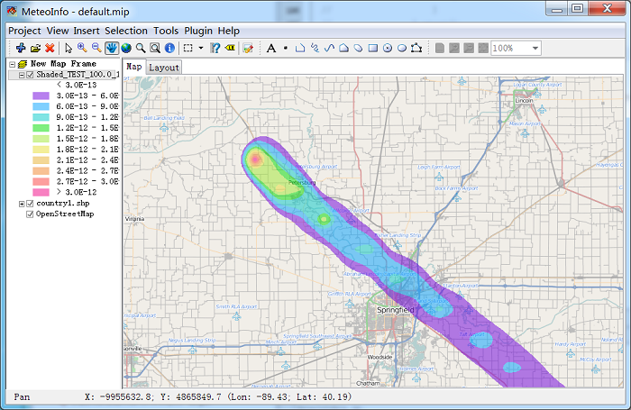
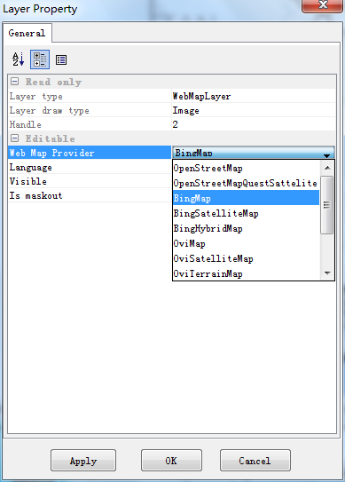

.. docs-meteoinfo-desktop-using_layers-webmap_layer:

************************
Web Map Layer
************************

The web tile images could be imported in a web map layer when internet connection is active. 
Currently supported web map providers:

- OpenStreetMap
- OpenStreetMapQuestSattelite
- BingMap
- BingSatelliteMap
- BingHybridMap
- GoogleMap
- GoogleSatelliteMap
- GoogleTerrainMap
- GoogleHybridMap
- GoogleHybridTerrainMap
- OviMap
- OviSatelliteMap
- OviTerrainMap
- OviHybridMap
- YahooMap
- YahooSatelliteMap
- YahooHybridMap

The tile images are Mercator projection, so the map should be project to Mercator firstly to 
match the tile images with other layers.

.. image:: ../../../_static/meteoinfo/webmap_mercator.png

To add a web map layer, a map frame should be click with right mouse button, then select 
"Add Web Map Layer" menu item to add the web map layer.

.. image:: ../../../_static/meteoinfo/webmap_addlayer.png

The map content will be showed automaticlly according to the map extent.

.. image:: ../../../_static/meteoinfo/webmap_global.png

The content of other layers could be overlaied on the web map with transparency color.

Double click the layer name or right click it and select "Property" menu item to open the 
layer property dialog. Several web map providers could be selected.

The sample web map providers of Bing map.

.. image:: ../../../_static/meteoinfo/webmap_bingmap.png

.. image:: ../../../_static/meteoinfo/webmap_bingsatellitemap.png

.. image:: ../../../_static/meteoinfo/webmap_binghybridmap.png