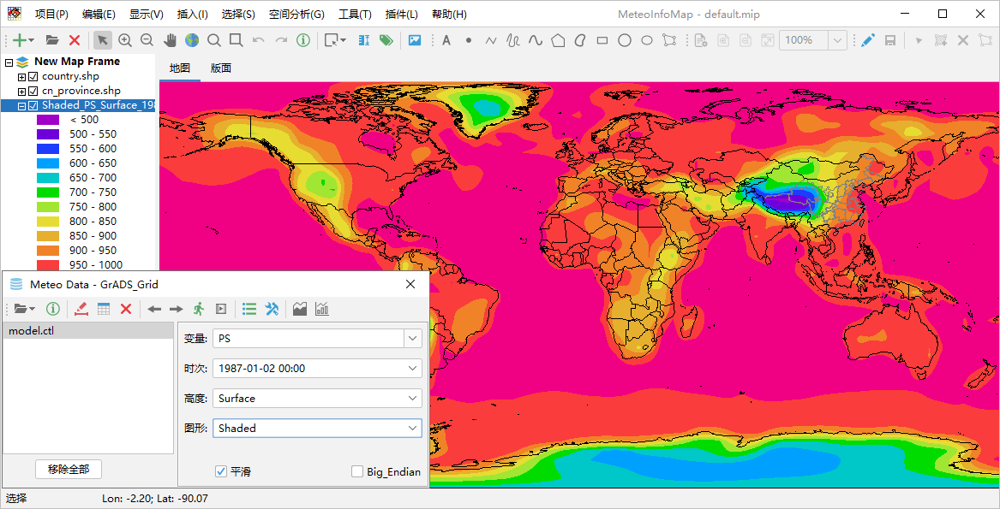
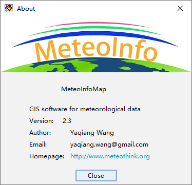

.. docs-meteoinfo-desktop_cn-introduction:

************************
MeteoInfoMap 软件简介
************************

MeteoInfoMap是一个支持多种气象数据格式的GIS桌面软件，包含了基本的GIS功能，可以将气象数据以地理图层的方式和
地图数据叠加显示，探索气象要素的空间分布特征。使用MeteoInfoMap可以仅通过点击鼠标的简单操作对数据的空间特性进
行展示、分析和出图，尤其适合对气象数据的快速图形化浏览以及交互式的复杂图形制作。

*************************
MeteoInfoMap 软件主界面
*************************

MeteoInfoMap主界面窗口主要由主菜单、工具栏、图层控制区、图形显示区和状态栏组成，其中图形显示区包含“地图”和“版面”
两个视图。软件打开后还可能出现气象数据操作对话框，该对话框被关闭后可以通过鼠标点击工具栏中的“打开数据文件”按钮再次打开。

MeteoInfoMap定义了项目文件“.mip”，包含了加载的所有图层位置和属性信息，以及地图和版面的显示信息等。MeteoInfo的安装
目录中有“default.mip”项目文件，MeteoInfoMap启动时会自动加载这个项目文件。软件的“项目”菜单可以打开和保存项目文件。

点击“帮助 -> 关于”菜单打开“About”对话框可以查看软件的版本等信息。点击“帮助 -> 帮助”菜单会自动在网页浏览器
中打开MeteoInfo网站的在线帮助文档。

