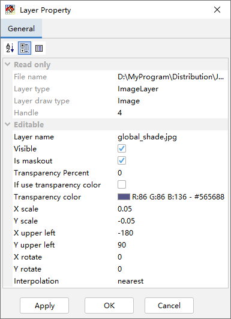

.. docs-meteoinfo-desktop_cn-map_layer-image_layer:

************************
图像图层
************************

MeteoInfo支持将一个图像文件打开通过地理定位作为一个图像图层加载，一般的图像文件是没有地理位置信息的，要进行地理定位
必须增加一个world文件。World文件是一个ASCII码文件，可以用任何文本编辑器来创建和编辑。图像文件的后缀通常是三个字符，
比如.jpg，world文件的命名是取对应图像文件名的前缀以及后缀的第一和第三个字符，最后增加一个w字符。比如图像文件名为
image.jpg，则对应的world文件名为image.jgw。

World文件包含的内容如下：

    20.17541308822119          -A

    0.00000000000000           -D

    0.00000000000000           -B

    -20.17541308822119         -E

    424178.11472601280548      -C

    4313415.90726399607956     -F

其中：

A是x方向的缩放比例，表明x方向图像的一个像素代表真实地理坐标x方向的长度；

D是x轴的旋转角度；

B是y轴的旋转角度；

E是y方向的缩放比例，表明y方向图像的一个像素代表真实地理坐标y方向的长度。E值通常是负值，因为图像坐标的起始点是左上角而
地理坐标的起始点是左下角；

C是左上角像素中心点的地理x坐标；

F是左上角像素中心点的地理y坐标。

在MeteoInfoMap中可以像加载Shapefile一样加载图像文件为一个图像图层，如果该图像已经有world文件，软件会按照world文件
里的参数将图像坐标转换为地理坐标。如果没有world文件，软件会自动创建一个，里面的参数可以通过图像图层的属性对话框进行调整。

双击图像图层名可以打开图像图层的属性对话框。可以看到world文件中的相关参数都可以在属性对话框中进行设置。还可以设置图像整
体的透明度，或者选择某一个颜色设置为透明。图像的显示可以设置插值方式（Interpolation）。图像图层对话框中没有图例
（Legend）选项，不能对图例进行更细致的设置。

