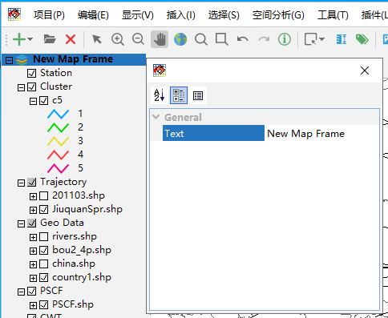
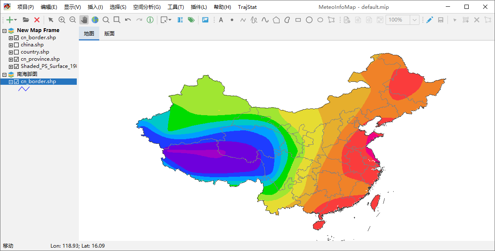
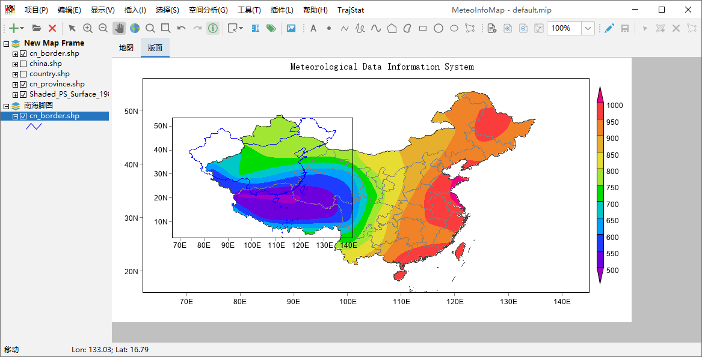
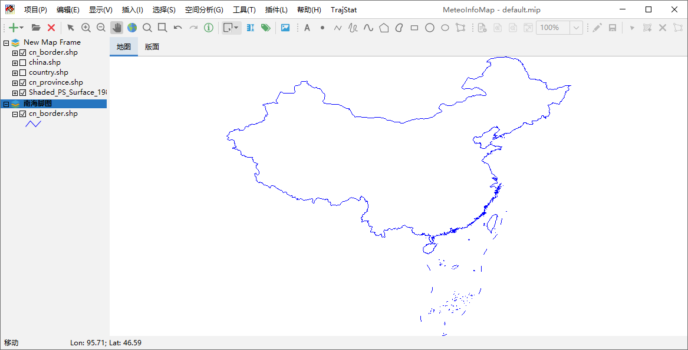
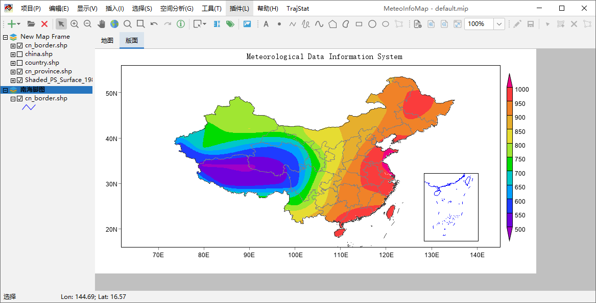

.. docs-meteoinfo-desktop_cn-map_layer-map_frame_layer_group:

************************
地图框架和图层组
************************

图层是由地图框架（Map Frame）和图层组（Layer Group）来管理的，一个图层组可以包含多个图层，一个地图框架可以包含
多个图层和图层组。双击地图框架名弹出地图框架属性对话框，可以修改地图框架的名称。

用鼠标选中地图框架名，点击右键出现的菜单中包括添加图层组（New Group）、添加图层（Add Layer）、添加网络图层
（Add Web Layer）和设置是否为活动地图框架（Active）。

.. image:: ./image/map_frame_right_menu.png

图层组可以将相似的图层组织起来，在图层很多的时候可以使得图层管理更为方便。

在MeteoInfoMap的图形显示区域，“地图”区域中只能显示一个地图框架的图形内容，如果有多个图形框架则显示活动（Active）
地图框架的内容。“版面”区域里可以显示所有地图框架的图形内容。下面我们增加一个地图框架作为南海脚图。

点击“插入 -> 图层框架”菜单插入一个图层框架，缺省名为New Map Frame 1，双击该图层框架名，在属性对话框修改图层框架
名为“南海脚图”。鼠标右键打开该图层框架的右键菜单，并添加cn_border.shp图层，修改图例为蓝色。可以看到“地图”区域显示
的是“New Map Frame”地图框架的内容，因为该地图框架是活动的，地图框架是否为活动框架可以从名称是否为加黑看出来。而在
“版面”区域两个地图框架的内容都显示了出来。

选中“南海脚图”地图框架名，点击右键并在弹出菜单中选择“Active”可以将“南海脚图”地图框架设为活动框架，这是“地图”区域显
示的就是该地图框架的内容。

可以通过在“版面”中移动、缩放和改变“南海脚图”地图框架的属性生成带南海脚图的中国地图。“版面”的具体操作会在后面的章节中
详细介绍。

