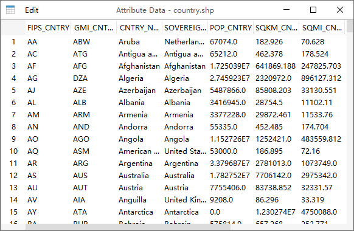
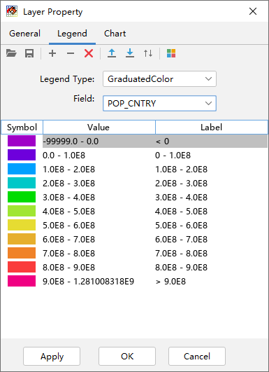
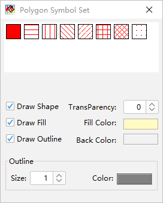
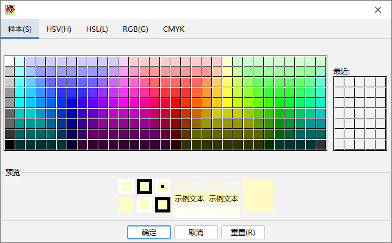
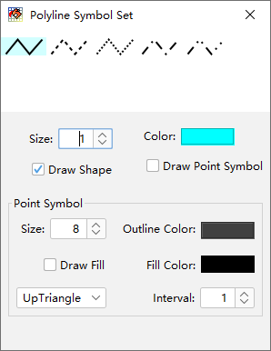
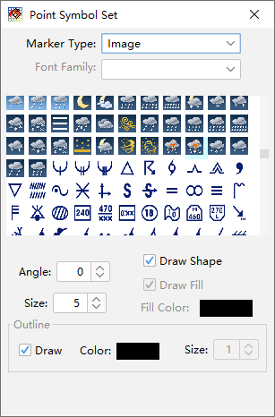
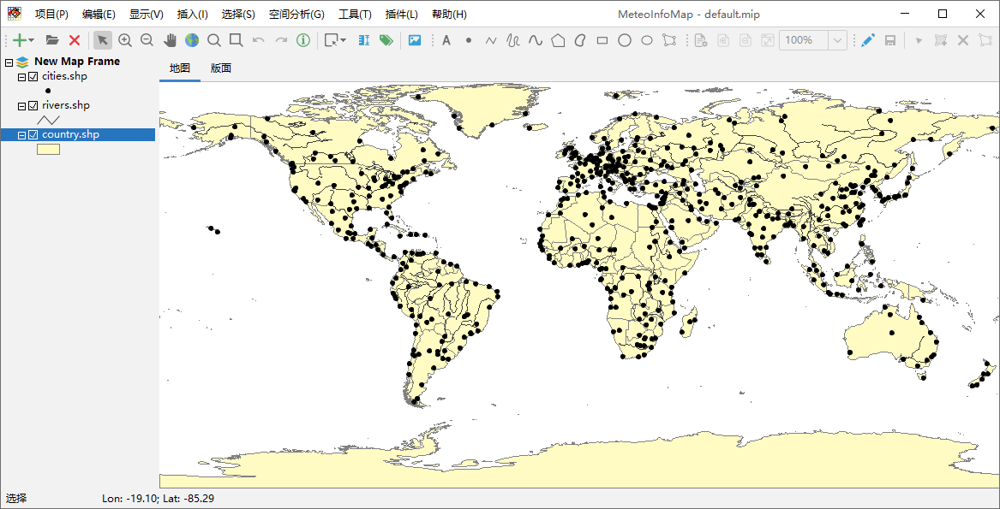
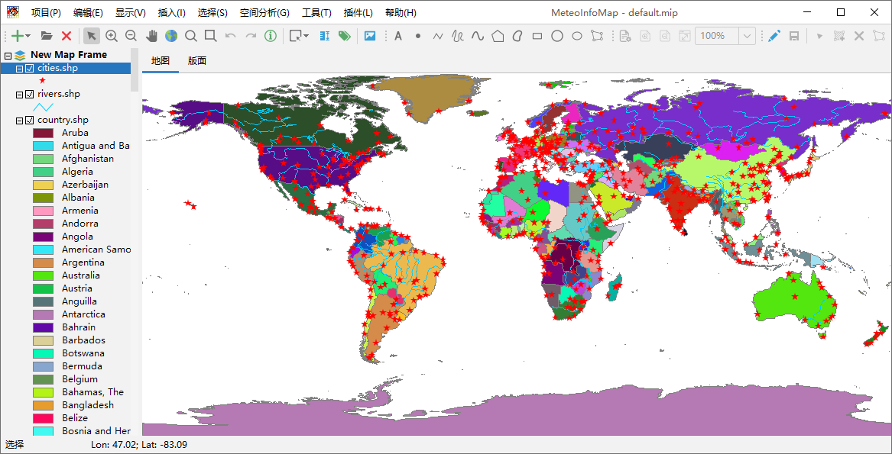

.. docs-meteoinfo-desktop_cn-map_layer-vector_layer:

************************
矢量图层
************************

矢量图层包含了矢量空间要素及其属性值，根据空间要素的类型又分为点图层（Point）、线图层（Polyline）和多边形图层
（Polygon）。用鼠标选中一个矢量图层，点击“显示 -> 图层属性数据”菜单可以打开图层的属性数据表。通过该表可以查看
图层的属性数据，还可以对属性数据进行编辑。

通过双击图层名可以打开图层属性对话框（这里以世界各国行政区域图层为例），包括了General、Legend和Chart三个选项卡。
在General选项卡中包含了图层对应的文件名、图层类型（VectorLayer）、图层空间要素类型等信息，还包含图层名、
Is maskout（屏蔽外部图形）和Avoid collision（免压盖）等可编辑属性。

.. image:: ./image/vector_layer_property.png

矢量图层在地图视图中的显示是由图例（Legend）决定的。图例类型有三种：单一符号（Single Symbol）、唯一值（Unique Value）
和颜色分级（Graduated Color）。单一符号是指图层中所有的空间要素都用一种颜色/符号显示。

.. image:: ./image/legend_single_symbol.png

唯一值和颜色分级两种图例类型需要图层的属性数据参与，需要选择属性字段（Field）。唯一值图例字段的类型可以是数值型和字符
型，而颜色分级图例字段的类型只能是数值型。例如选择唯一值图例类型，然后再选择CNTRY_NAME字段（国家名称），那么每个不同
的国家名就会用一个不同的符号来区分；选择颜色分级图例类型，然后再选择POP_CNTRY字段（国家人口），就会根据人口的数量分几
个级别来显示不同的空间要素。

.. image:: ./image/legend_unique_value.png

一个图例中可能包含一个或多个图例项从而形成图例列表，每个图例项中包含了符号（Symbol）、值（Value）和标注（Label），
它们都可以通过双击鼠标被编辑。值是指空间要素对应的属性字段的值，如果是颜色分级图例值就是一个左闭右开的范围，比如
100 – 200表示： ≥100并<200。标注是最终显示在图例项旁边的字符。符号控制了空间要素的显示方式，点、线和多边形有不同的
符号体系。

双击符号项的图形部分可以打开符号设置对话框。多边形符号由填充和轮廓线条组成，对于多边形空间要素的符号设置对话框，上面是
集中常用的多边形填充方式，其中第一个是实心填色，后面几个是不同的填充花纹。绘制空间要素（Draw Shape）选项选中时空间要
素才会被绘制在地图视图中。填充多边形（Draw Fill）选项可以控制是否填充多边形，绘制轮廓线（Draw Outline）选项可以控
制是否绘制多边形的轮廓线。填充颜色（Fill Color）和透明度（Transparency）选项设定了多边形填充的颜色和透明度，用鼠标
点击Fill Color右边的填色矩形可以打开颜色选择对话框来选择多线性填充颜色。透明度的有效值是0 – 100，0代表不透明，100
代表完全透明，中间的值越高表明透明度越高。背景色（Back Color）在多线性花纹填充时有效，此时Fill Color是花纹的颜色，
Back Color是多边形的背景填充色。多边形的轮廓线可以设置线条的宽度（Size）和颜色（Color）。

线符号设置对话框中上面是线型的选择，绘制空间要素（Draw Shape）选项设置是否绘制此类空间要素，宽度（Size）和颜色
（Color）选项设置线条的宽度和颜色。线条是由多个点连接组成的，组成线条的点是否显示是由绘制点符号（Draw Point Symbol）
选项控制的。点符号（Point Symbol）组中的选项用来设置点的大小、式样、填充色、轮廓线颜色等，间隔（Interval）选项可以
控制间隔几个才显示一个点。

点符号设置对话框上面可以选择点标记类型和具体的符号。点标记类型（Marker Type）包括：Simple（简单点符号）、
Character（字体符号）和Image（图像符号）。简单点符号包含了一些常用的表示点的图形，比如圆、正方形、三角形等，
可以设置点图形的大小、角度、填充颜色以及轮廓线的宽度、颜色等。

.. image:: ./image/point_symbol_set.png

点标记类型为字体符号时，计算机系统中安装的所有字体名称会出现在字体名称（Font Family）下拉选项框中。MeteoInfo软件自
带了Weather字体，包含了所有的天气现象符号。字体符号的大小、角度、颜色也可以用对话框下面的选项来设置。

.. image:: ./image/point_symbol_set_character.png

点标记类型为图像符号时，MeteoInfo软件路径中image目录中的图片会显示出来供选择，用户可以将需要的图片文件放入此目录中
来丰富图片的选项。图像符合的大小和角度也可以进行设置。

下面的图中MeteoInfoMap加载了三个图层：country.shp、river.shp和cities.shp，这三个图层的类型分别是多边形图层、
线图层和点图层，它们的Shapefile文件可以在MeteoInfo安装路径中的map目录中找到。刚加载的图层会设置缺省的简单图例。

通过对三个图层的图例进行设置，得到下面的显示效果。

