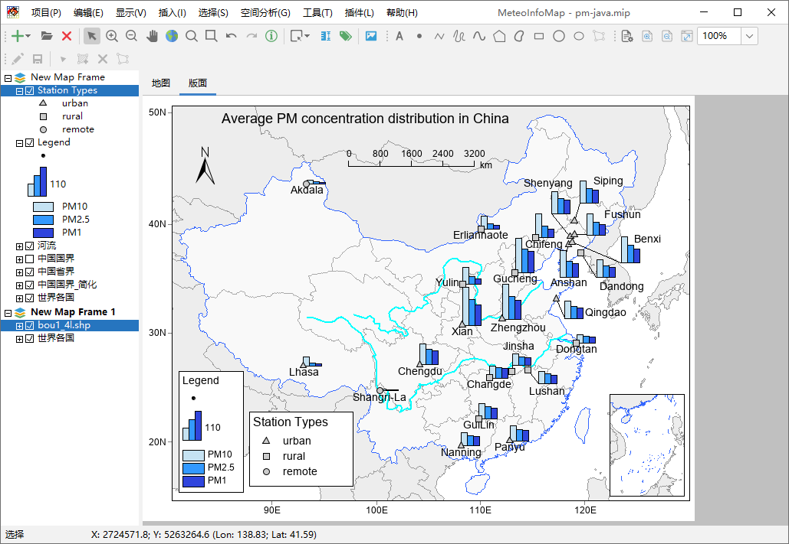
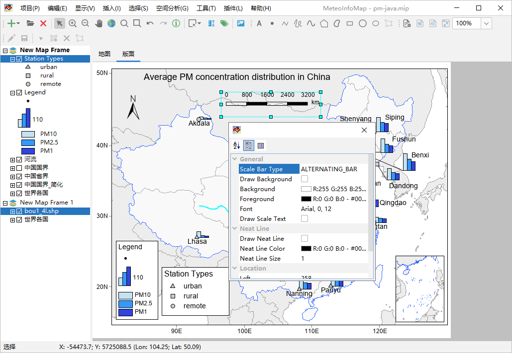
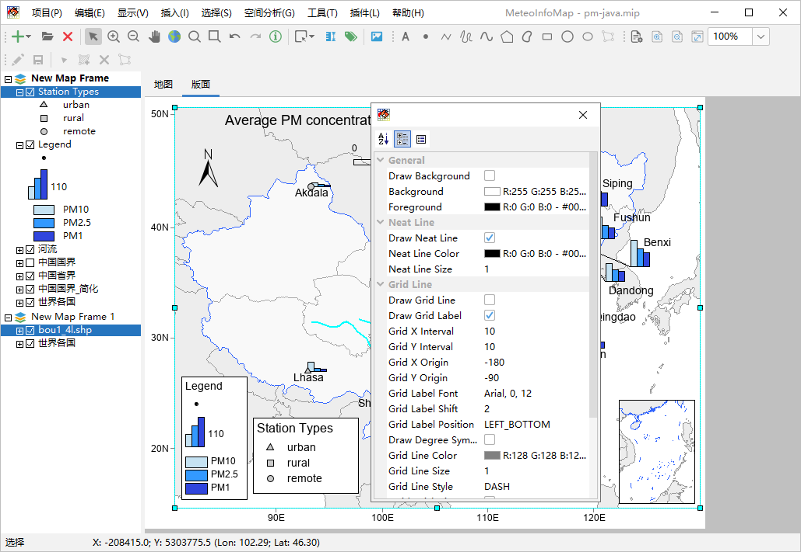
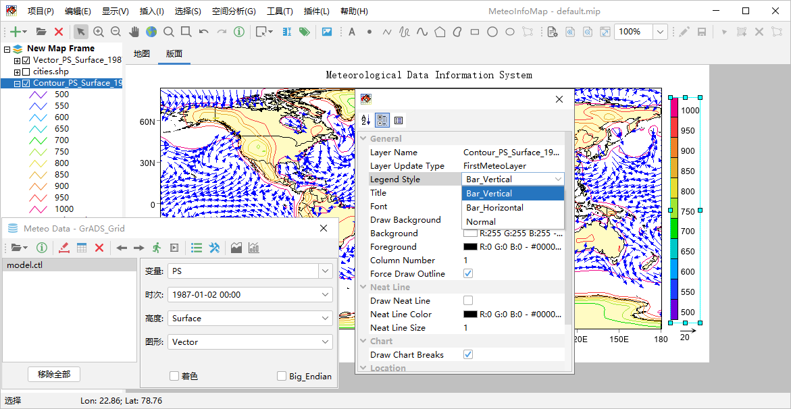
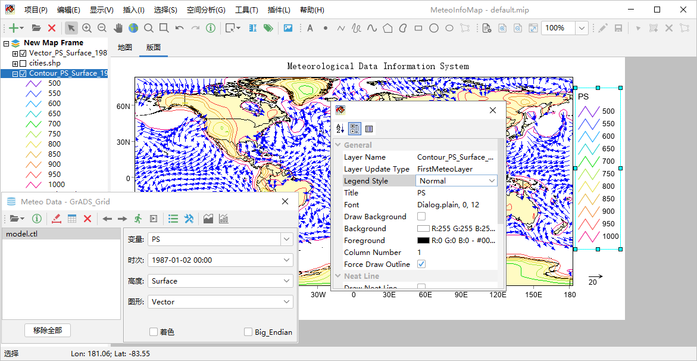

.. docs-meteoinfo-desktop_cn-maplayout-insert_element:

************************
在版面中插入地图要素
************************

在“插入”菜单中有“标题”、“文字”、“图例”、“比例尺”、“指北针”和“风箭头”几个可供插入版面的地图要素，而最重要的地图要素是
地图框架要素。

和在地图中添加文字标记类似，在版面中插入的标题和文字都可以被选中、移动和编辑。指北针标明了地图正北方向，比例尺指示了地图
长度和实际地理长度的比例。图例标明了图形要素中不同符号的含义。比例尺有多种表现形式，选中后双击打开属性设置对话框，选择比
例尺类型（Scale Bar Type）可以改变其绘制方式。

图中包含了两个地图框架要素，其中一个作为南海脚图。地图框架也支持工具栏中的地图显示范围缩放工具，方便对显示范围进行调整。
可以用鼠标选中版面中的地图框架要素，进行交互式移动和尺寸缩放，方便进行布局调整。选中地图框架要素后双击出现属性对话框，
可以对其进行各种设置。其中经纬线和经纬度标注的一些设置最为常用，包括是否显示经纬线、是否标注经纬度、经纬线起始和间隔、
经纬度标注字体、位置、经纬线符号设置等。

图例是地图的重要组成部分，指示了地图中要素符号的含义。图例选中后双击出现图例设置对话框，可以设置该图例是哪个图层的图例、
图例类型、标题、字体、列数等。其中图例类型分为竖条（Bar_Vertical）、横条（Bar_Horizontal）和标准（Normal）。

图例类型设置为Normal后，图例的显示会根据空间要素类型（点、线或多边形）而不同，比如等值线的图例会显示为折线。在版面中可以
插入多个图例，下图中包含了Normal类型的多边形图例和点图例。如果有风矢量图层，也可以插入风箭头要素。

