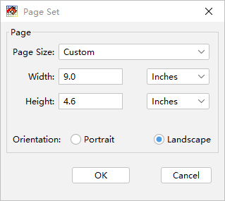
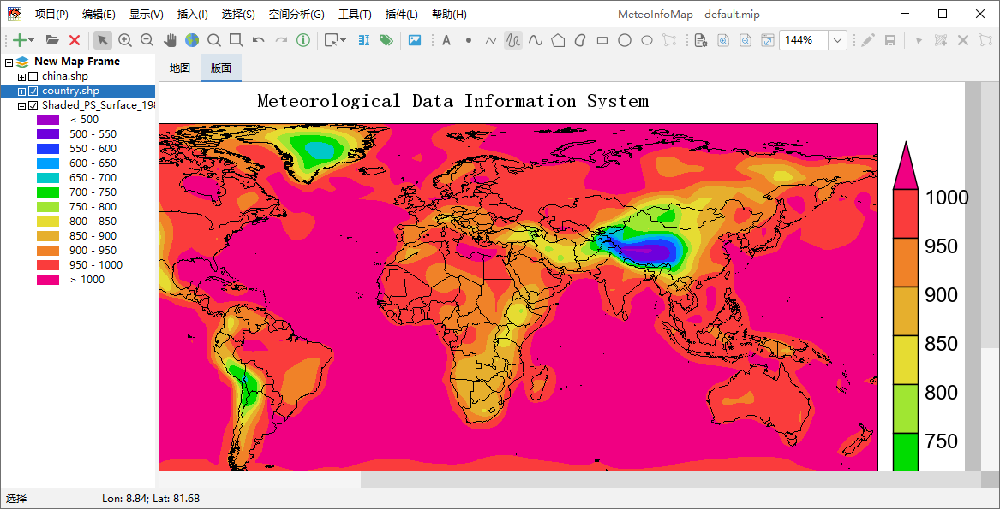

.. docs-meteoinfo-desktop_cn-maplayout-page_set:

************************
页面设置和缩放
************************

和地图视图不同，版面的虚拟页面是有长宽尺寸的。拉动软件界面边框时地图视图的范围会随之变化，而版面的尺寸是固定的。页面尺寸
之外的部分显示为灰色。切换到版面布局视图后版面设置工具栏状态变为可用，点击工具栏中“页面设置”按钮会弹出页面设置对话框，用
来设置页面的长和宽。

版面也可以进行缩放，工具栏中有“放大页面”、“缩小页面”、“缩放至窗口范围”按钮和一个缩放比例的下拉选择框可以用来控制页面的
缩放。需要注意的是页面缩放并不改变页面的尺寸，只是调整用多大比例来在屏幕上显示页面。当页面显示范围大于界面视图范围时，
界面的右边和（或）下边会出现滚动条来帮助浏览页面的内容。

