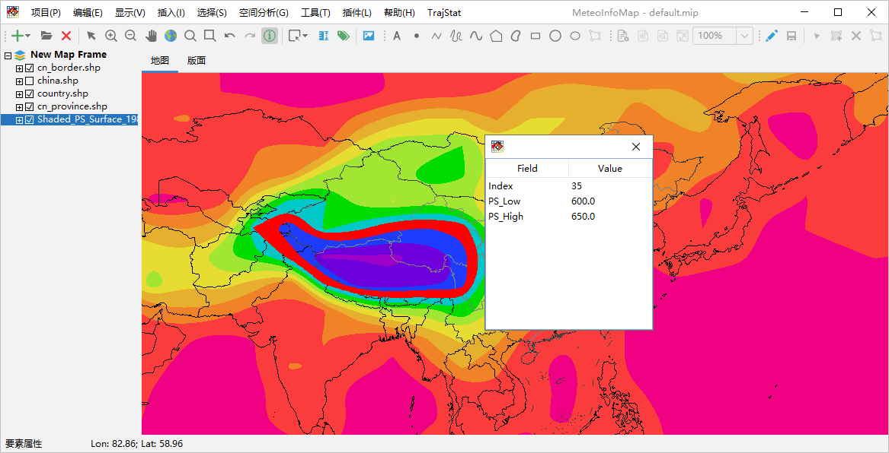
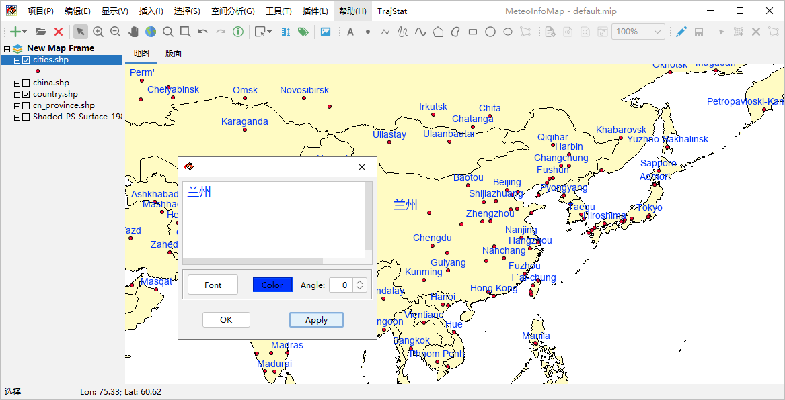

.. docs-meteoinfo-desktop_cn-mapview-attribute_label:

************************
图层属性数据查询和标注
************************

矢量图层是有属性数据的，选中某个矢量图层，点击工具栏中的“要素属性”按钮，可以在地图上点击图层中的某个空间要素来查看起
属性数据，被选中的空间要素会高亮显示。

选中一个矢量图层后可以利用图层的属性数据对图层的空间要素进行自动标注。例如选中加载的cities.shp图层，点击工具栏中的
“标注”按钮，弹出标注设置对话框，选择要标注的属性字段（Field），点击Update就能够将字段中每个空间要素的属性值标注在
空间要素位置上，对话框中还可以对标注字体、颜色、位置等进行设置。我们利用NAME字段将城市名标注在每个城市位置上，并修改
字体、颜色和Y方向的偏移量（Y Offset）。对于标注可以设置是否免压盖（Avoid Collision），该属性选中的状态下有些标注
会不再显示以避免标注互相压盖的现象。

.. image:: ./image/layer_label.png

选中工具栏中的“选择”按钮，可以用鼠标在地图上选中某个标注，并可移动其位置。

.. image:: ./image/move_label.png

双击标注可以在弹出的标注设置对话框中设置标注的文字内容、字体、颜色和角度。

