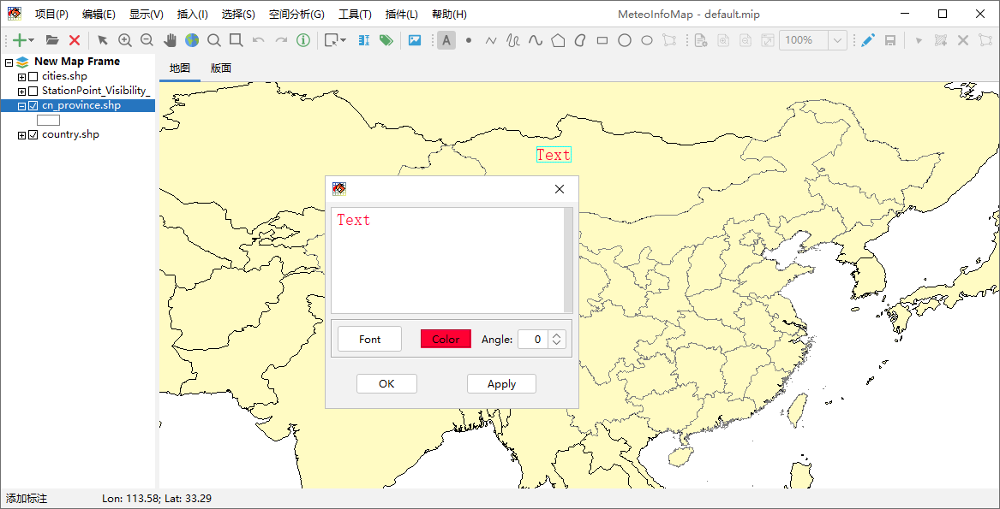
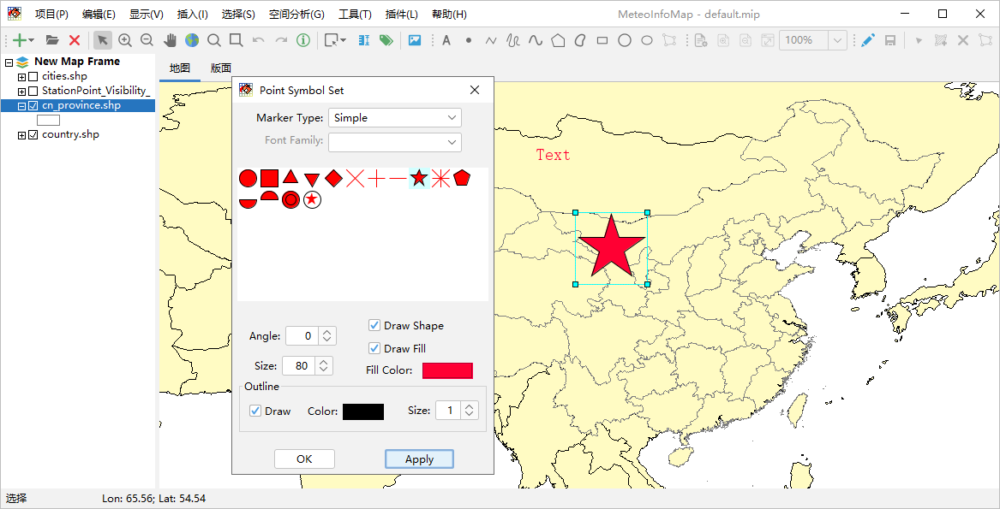
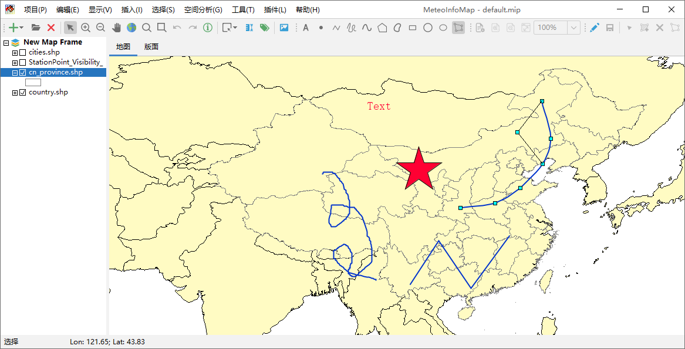
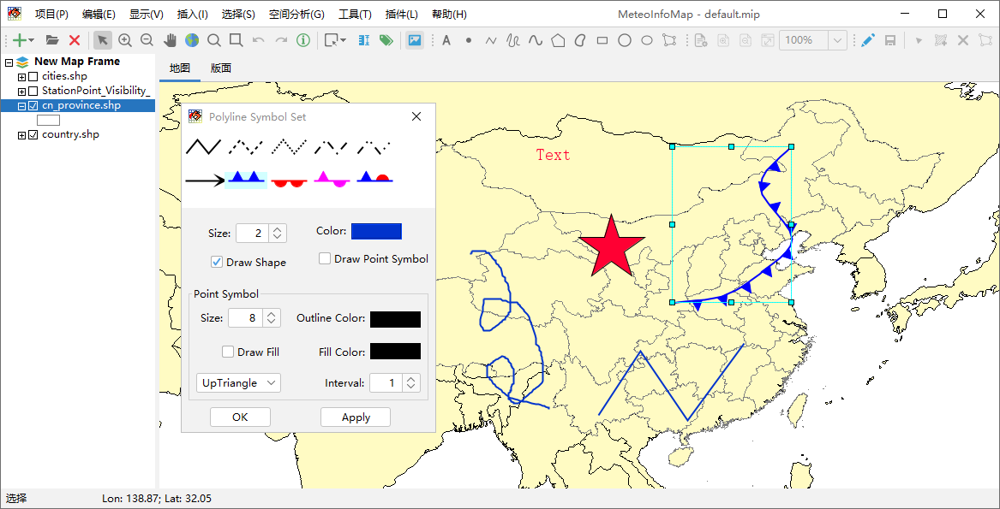
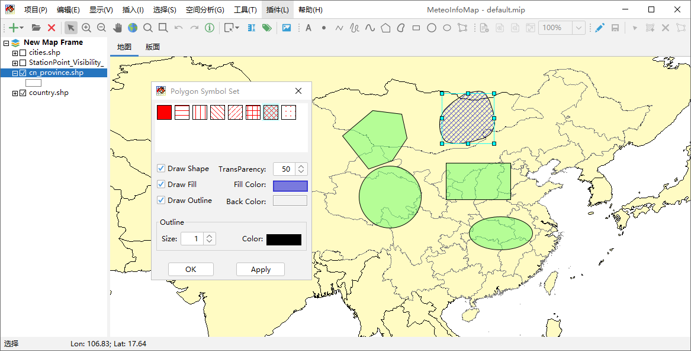

.. docs-meteoinfo-desktop_cn-mapview-interactive_drawing:

************************
交互式图形绘制
************************

MeteoInfoMap提供了丰富的交互式绘制图形工具，可以方便的绘制文字、点、线条和各种多边形。点击工具栏中“添加标注”按钮，
用鼠标左键在地图上点击即可添加文字Text。点击工具栏中的“选择”按钮，用鼠标选中添加的文字，双击鼠标出现文字设置对话框，
可以修改文字内容、字体、颜色和角度，并通过鼠标移动文字的位置。

点击工具栏中的“添加点”按钮可以用鼠标在地图区域添加点，选中添加的点后双击可以打开点符号设置对话框对点的显示符号进行修改。

通过工具栏中“添加线”、“添加手绘线”和“添加曲线”工具可以在地图上添加相应的线条，选中添加的线条后点击“编辑节点”按钮可以
用鼠标编辑线条上的节点从而实现对线条的修改，再次点击“编辑节点”按钮退出节点编辑状态。选中线条后双击弹出线条符号设置对话
框，可以对线条的显示符号进行修改。

通过工具栏中“添加多边形”、“添加曲线多边形”、“添加长方形”、“添加圆”和“添加椭圆”工具可以在地图上添加相应的多边形。和线条
编辑类似，选中添加的多边形后点击“编辑节点”按钮可以用鼠标编辑多边形边界上的节点从而实现对多边形的修改，再次点击“编辑节点”
按钮退出节点编辑状态。选中多边形后双击弹出多边形符号设置对话框，可以对多边形的显示符号进行修改。

