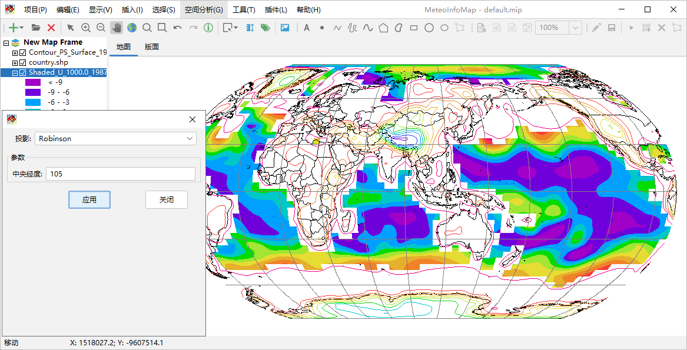

.. docs-meteoinfo-desktop_cn-mapview-projection:

************************
地图投影
************************

通过“显示 -> 投影”菜单可以调出地图投影设置对话框，通过设置投影类型和相关的参数可以实时改变地图的投影方式。MeteoInfo通过
Proj4J库（https://github.com/locationtech/proj4j）支持大多数地图投影类型，但在这个投影设置对话框中只包含了气象领
域常用的一些投影类型，包括：

  -	等经纬度投影（LongLat）
  -	兰伯特投影（Lambert_Conformal_Conic）
  -	阿尔伯斯等积投影（Albers_Equal_Area）
  -	北极极射赤平投影（North_Polar_Stereographic_Azimuthal）
  -	南极极射赤平投影（South_Polar_Stereographic_Azimuthal）
  -	墨卡托投影（Metcator）
  -	罗宾逊投影（Robinson）
  -	莫尔维德投影（Mollweide）
  -	正射投影（Orthographic_Azimuthal）
  -	对地静止卫星投影（Geostationary_Satellite）
  -	斜立体投影（Oblique_Stereographic_Alternative）
  -	横轴墨卡托投影（Transverse_Mercator）
  -	正弦投影（Sinusoidal）
  -	圆柱等积投影（Cylindrical_Equal_Area）
  -	哈默埃克特投影（Hammer_Eckert）

