.. docs-meteoinfomap-desktop_cn-meteo_data-grid_data:

************************
生成格点数据GIS图层
************************

气象格点数据通常是多维的，常见的维是时间维、高度维、纬度维（Y维）和经度维（X维），要生成地理空间的GIS图层需要将时间维和高
度维固定，从某个变量中获取地理空间二维格点数据，然后再从二维格点数据生成各种GIS图层。对于格点数据可以绘制成以下几种类型的图层：

  -	栅格图层（Raster），生成栅格图层（RasterLayer），二维数据以图像形式显示，显示速度快，适合高分辨率和分布离散性高的格点数据（例如卫星云图数据）；
  -	等值线（Contour），生成矢量线图层（Polyline VectorLayer），需要进行等值线追踪；
  -	等值线填色（Shaded），生成矢量多边形图层（Polygon VectorLayer），需要进行等值线追踪、拓扑填色，对于高分辨率和分布离散性高的格点数据等值线分析速度会比较慢；
  -	格点填色（Grid Fill），生成矢量多边形（矩形）图层（Polygon VectorLayer），以格点空间位置为中心点生成相邻的矩形组成一个图层，格点数很多的时候会影响显示速度；
  -	格点点图（Grid Point），生成矢量点图层（Point VectorLayer），根据格点空间位置生成点图层；
  -	风场矢量（Vector），生成风场矢量点图层（Wind VectorLayer），根据风场U/V分量或者风向、风速数据生成点图层，以风箭头的形式显示；
  -	风向杆（Barb），生成风场风向杆点图层（Wind VectorLayer），根据风场U/V分量或者风速、风向数据生成点图层，以风向杆的形式显示；
  -	风场流线（Streamline），生成风场流线图层（Polyline VectorLayer），根据风场U/V分量进行风场流线追踪，生成流线图层，以线条和流线方向箭头形式显示。

等值线与等值线填色
======================

等值线与等值线填色是气象数据非常重要的图形化表现形式，能够很好地体现二维格点数据的分级分布特征，例如不同降水量等级的空间分布
等。这里以model.grb数据为例，打开该数据文件后，选择数据中的地面气压变量（Pressure_surface），设置数据时次和高度（此变量
只有一个高度），“图形”下拉选项框设置为Contour，点击工具栏中“绘制数据图形”按钮生成地面气压的等值线图层。等值线追踪后可以选
择是否对等值线进行平滑处理，可以通过对话框中的“平滑”选项来控制。生成的等值线图层会将地面气压值作为属性数据放入等值线图层的
属性表中。

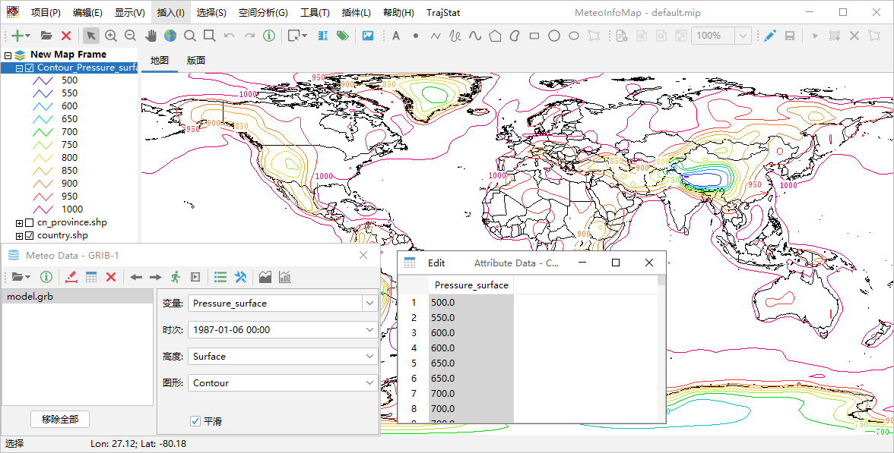

数据文件中的风场U分量变量（u-component_of_wind_isobaric）是4维变量（时间、高度、纬度和经度维），其高度维是等压面，这
里设置“高度”为1000百帕，“图形”为Shaded，点击“绘制图形数据”按钮生成该变量设定时次1000百帕高度的等值线填色图层。1000百帕
高度陆地上基本都是缺测值，形成等值线填色图层的空白区域。

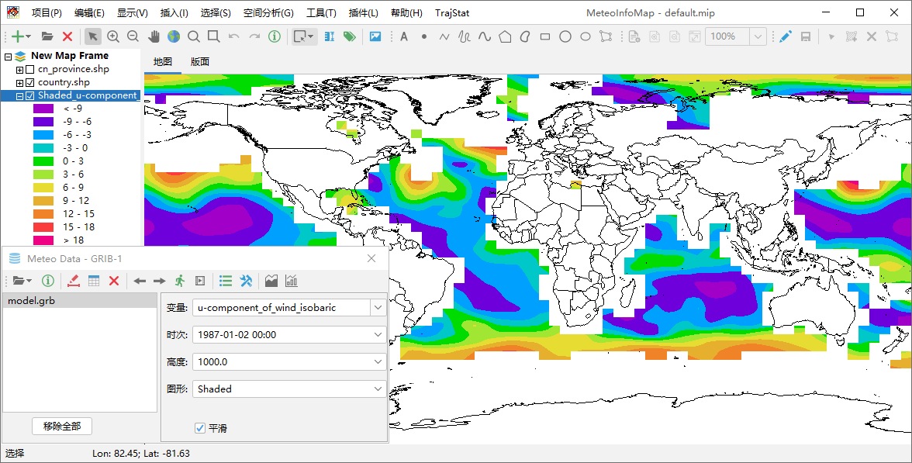

生成等值线或者等值线填色图层时，软件会根据数据值的分布情况自动设定等值线分级数和每级的等值线值。如果要自定义等值线分级可以点击
工具栏中的“图例设置”按钮打开图例设置对话框。

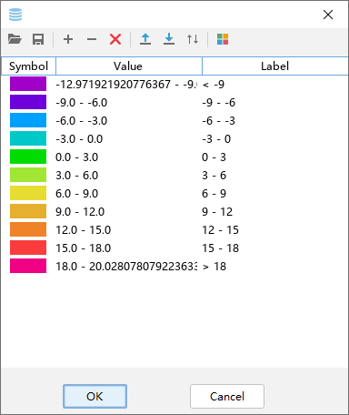

和图层图例编辑操作类似，编辑完成后点击“OK”按钮会对重新生成等值线或等值线填色图层。需要注意的是已经生成的等值线或等值线填色图层，
不能通过图层图例设置重新追踪等值线。

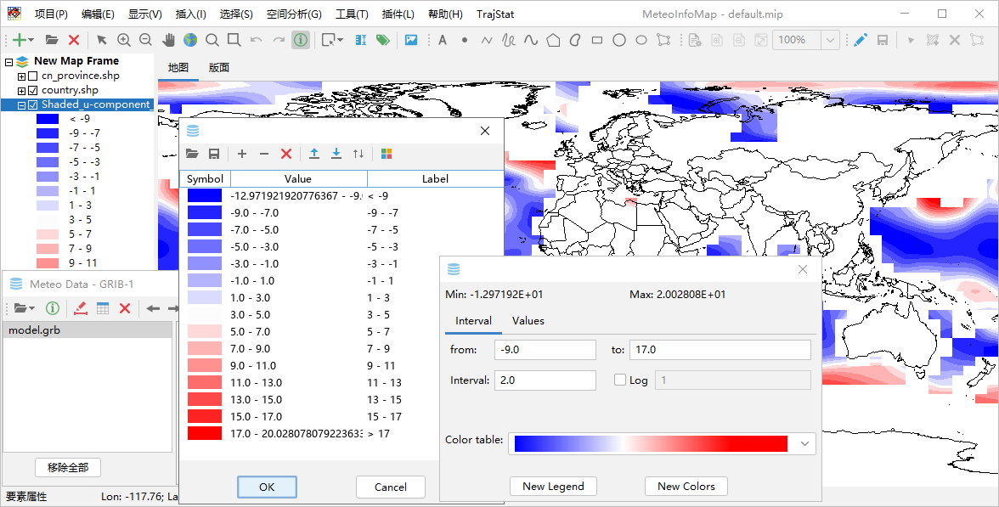

格点填色与格点点图
=======================

格点填色是简单的把格点按照空间坐标生成相邻的系列矩形多边形，从而形成多边形图层，变量的属性值加入到图层的属性表中。

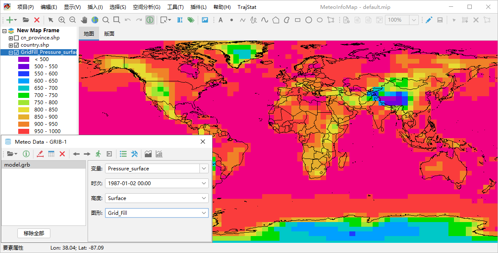

格点点图是将格点数据按照空间坐标生成系列点空间要素，从而形成点图层，变量的属性值加入到图层的属性表中。

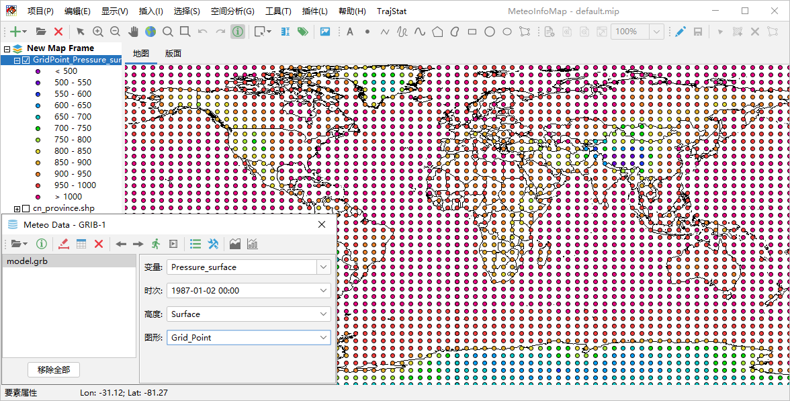

栅格图层
=======================

和格点填色类似，格点数据根据空间位置和格点的变量值生成栅格图层（RasterLayer），图层是以图像的形式显示，适合高分辨率和分布
离散度高的格点数据，比等值线填色和格点填色的处理和显示速度快很多，尤其适合卫星图像格点数据的显示。栅格图层每个格点的数据值也
可以通过“要素属性”工具提取。

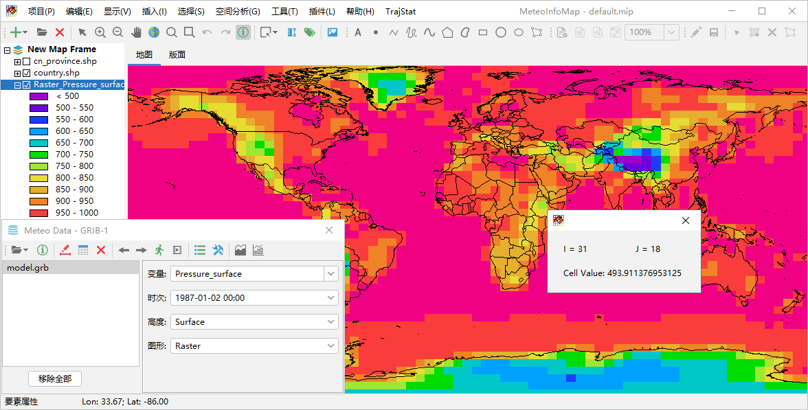

风场矢量和风向杆
=======================

格点数据文件中如果包含风场U/V分量或者风向、风速变量，可以通过设置风场变量来生成风场矢量或者风向杆图层。在气象数据对话框中
将“图形”设置为Vector，点击“绘制数据图形”按钮，软件会自动在数据包含的变量中查找U/V变量，一些简单的U/V变量名软件可以自动
识别出来，这个数据文件例子中的U/V变量名比较复杂，软件不能自动识别，会弹出一个设置对话框（点击工具栏中的“设置”按钮也可以弹
出该对话框）来让用户自行设置风场的变量。设置对话框中可以选中风场变量是U/V还是风向风速（Direction/Speed），支持U/V变量
或者风向风速变量在不同的文件中，通过数据文件和变量下拉框进行选择。如果风场数据空间上太过密集，还可以设置X和Y方向上格点数据
的间隔（Skip Factors），从而降低风场显示的密集度。

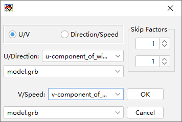

设置完成后即可通过风场U/V分量或者风向风速变量生成风场矢量图层。如果选中气象数据对话框中“着色”选项，可以根据“变量”框中
选定的变量数据对风场矢量绘制颜色。

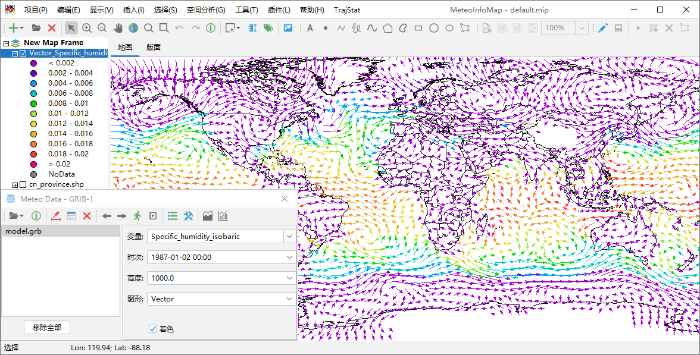

生成风场风向杆图层和风场矢量图层类似，区别在于要将气象数据对话框中“图形”选为Barb。

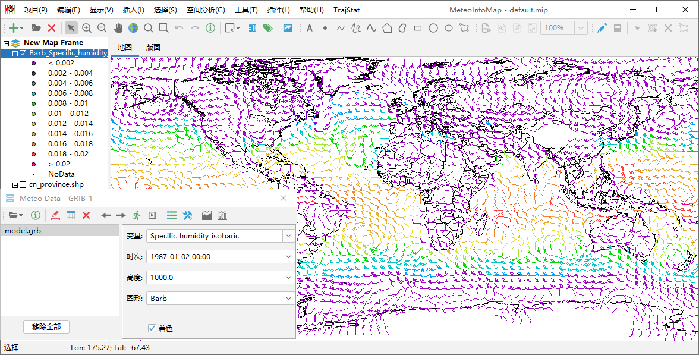

风场流线
====================

风场流线的追踪同样需要指定U/V分量变量，气象数据对话框中“图形”设置为Streamline，点击“绘制数据图形”按钮既可生成风场流线图层。

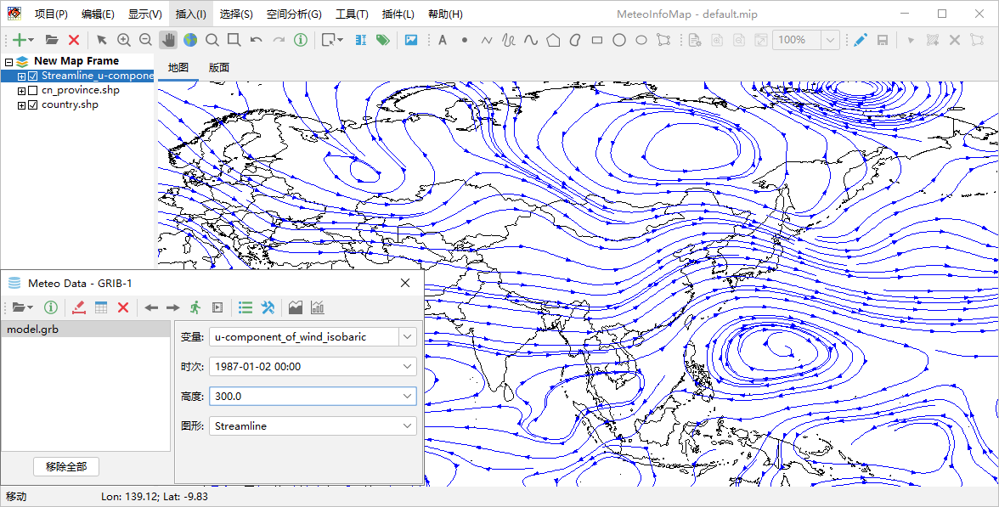

点击工具栏中“设置”按钮打开流线密度设置对话框，可以设置流线的疏密程度（Streamline density）。流线密度取值在1-10范围内的整
数，数值越高密度越大，缺省是4，例如将其改为2生成的流线就会较为稀疏。

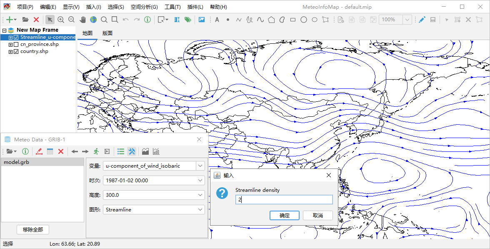

利用已有变量生成新变量
=======================

在气象数据对话框“变量”栏中可以通过编写简单的公式，从数据已有变量生成新的变量。例如打开“MeteoInfo -> sample -> GrADS”目
录中model.ctl文件，该数据文件中包含风场的U/V分量变量U和V，但没有风速变量。可以在“变量”栏输入公式“sqrt(U*U+V*V)”计算出风
速，并以此为新变量生成风速等值线填色图。

支持的运算符号包括：“+”、“-”、“*”、“/”、“%”，“^”；函数包括：“abs”、“acos”、“asin”、“atan”、“cos”、“exp”、“log”、
“log10”、“sin”、“sqrt”、“tan”。

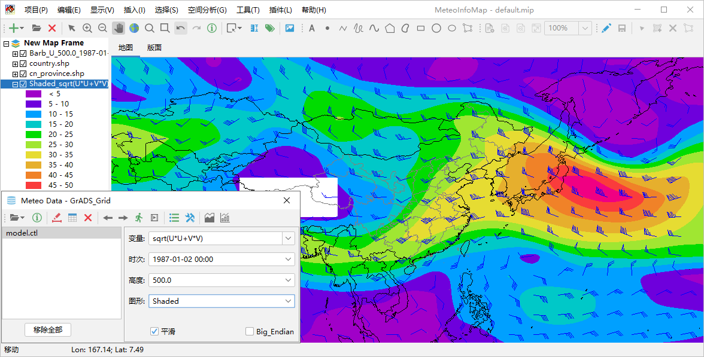