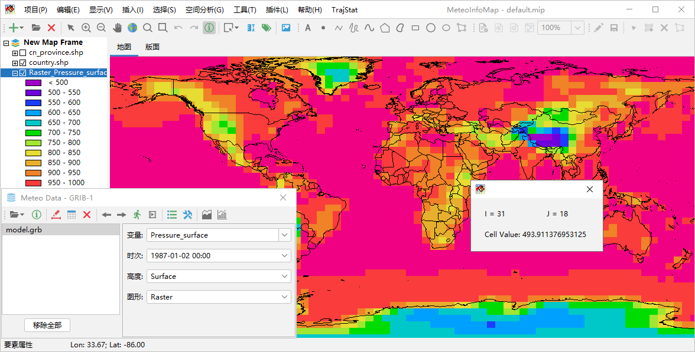
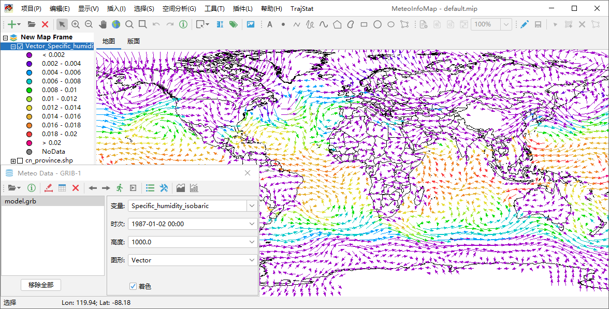

.. docs-meteoinfomap-desktop_cn-meteo_data-traj_data:

************************
生成轨迹数据GIS图层
************************

轨迹数据主要包括气团轨迹和台风路径等气象线状数据，可以生成GIS线图层，线是由点组成的，因此也可以从轨迹数据中生成点图层。

气团轨迹数据绘制
======================

气团轨迹指微小气团在大气中移动的实际路径，常用来追踪大气污染物、水汽等的来源。HYSPLIT模式是NOAA的ARL实验室开发的用来计算
简单的气团轨迹以及模拟复杂的扩散和沉积的模式，在全球有很多用户。HYSPILIT模式输出的气团轨迹计算结果数据文件可以用气象数据对
话框“HYSPLIT -> Trajectory”菜单打开，轨迹输出文件至少有气压（PRESSURE）变量，还可能有其他用户自定义的输出变量。选择“图形”
为Traj_Line，点击“绘制数据图形”按钮生成轨迹GIS线图层。

“图形”设置为Traj_Point可以生成包含轨迹线上所有的节点的轨迹点图层。

“图形”设置为Traj_StartPoint可以生成所有气团轨迹起始点图层。

台风路径绘制
=======================

台风路径的绘制和气团轨迹类似，在气象数据对话框中打开“MeteoInfo -> sample -> MICAPS”目录中的Typhoon_obj1ebabj0808.dat
文件，该文件为MICAPS第7类数据文件，包含了一条客观预报台风路径。可以绘制出台风路径线图层、点图层和起点图层。

格点点图是将格点数据按照空间坐标生成系列点空间要素，从而形成点图层，变量的属性值加入到图层的属性表中。

.. image:: ./image/grid_point_layer.png

栅格图层
=======================

和格点填色类似，格点数据根据空间位置和格点的变量值生成栅格图层（RasterLayer），图层是以图像的形式显示，适合高分辨率和分布
离散度高的格点数据，比等值线填色和格点填色的处理和显示速度快很多，尤其适合卫星图像格点数据的显示。栅格图层每个格点的数据值也
可以通过“要素属性”工具提取。

风场矢量和风向杆
=======================

格点数据文件中如果包含风场U/V分量或者风向、风速变量，可以通过设置风场变量来生成风场矢量或者风向杆图层。在气象数据对话框中
将“图形”设置为Vector，点击“绘制数据图形”按钮，软件会自动在数据包含的变量中查找U/V变量，一些简单的U/V变量名软件可以自动
识别出来，这个数据文件例子中的U/V变量名比较复杂，软件不能自动识别，会弹出一个设置对话框（点击工具栏中的“设置”按钮也可以弹
出该对话框）来让用户自行设置风场的变量。设置对话框中可以选中风场变量是U/V还是风向风速（Direction/Speed），支持U/V变量
或者风向风速变量在不同的文件中，通过数据文件和变量下拉框进行选择。如果风场数据空间上太过密集，还可以设置X和Y方向上格点数据
的间隔（Skip Factors），从而降低风场显示的密集度。

.. image:: ./image/wind_variable_setting.png

设置完成后即可通过风场U/V分量或者风向风速变量生成风场矢量图层。如果选中气象数据对话框中“着色”选项，可以根据“变量”框中
选定的变量数据对风场矢量绘制颜色。

生成风场风向杆图层和风场矢量图层类似，区别在于要将气象数据对话框中“图形”选为Barb。

.. image:: ./image/grid_barb_layer.png

风场流线
====================

风场流线的追踪同样需要指定U/V分量变量，气象数据对话框中“图形”设置为Streamline，点击“绘制数据图形”按钮既可生成风场流线图层。

.. image:: ./image/grid_streamline_layer.png

点击工具栏中“设置”按钮打开流线密度设置对话框，可以设置流线的疏密程度（Streamline density）。流线密度取值在1-10范围内的整
数，数值越高密度越大，缺省是4，例如将其改为2生成的流线就会较为稀疏。

.. image:: ./image/grid_streamline_density.png

利用已有变量生成新变量
=======================

在气象数据对话框“变量”栏中可以通过编写简单的公式，从数据已有变量生成新的变量。例如打开“MeteoInfo -> sample -> GrADS”目
录中model.ctl文件，该数据文件中包含风场的U/V分量变量U和V，但没有风速变量。可以在“变量”栏输入公式“sqrt(U*U+V*V)”计算出风
速，并以此为新变量生成风速等值线填色图。

支持的运算符号包括：“+”、“-”、“*”、“/”、“%”，“^”；函数包括：“abs”、“acos”、“asin”、“atan”、“cos”、“exp”、“log”、
“log10”、“sin”、“sqrt”、“tan”。

.. image:: ./image/new_variable_layer.png