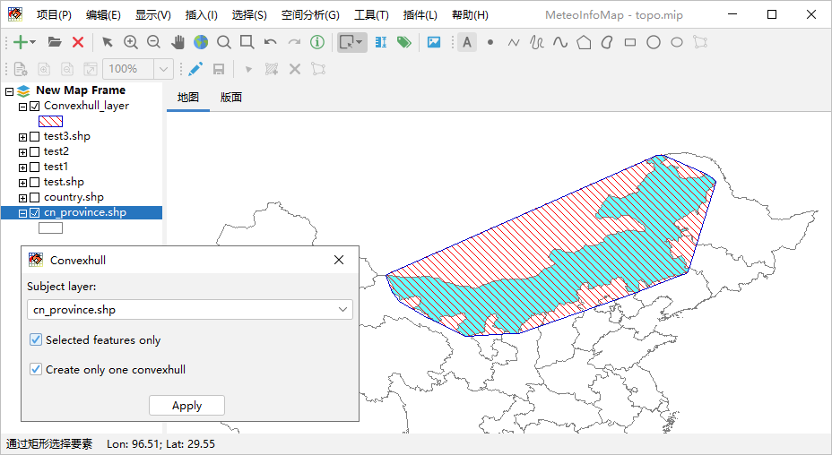

.. docs-meteoinfo-desktop_cn-spatial_analysis-convexhull:

************************
凸包分析
************************

凸包（Convex hull）分析指的是获取多边形要素的最小外包凸多边形。这里示例做内蒙古区域的凸包分析，在cn_province.shp图层
选中内蒙古区域空间要素，点击“空间分析 -> 凸包”菜单打开凸包分析对话框，选择要进行凸包分析的图层（subject layer），只针对
被选中的空间要素进行凸包分析需要选中Selected features only，如果有多个要素进行分析且希望凸包重复部分可以合并需要选中
Create only one convexhull，点击Apply按钮生成一个新的凸包多边形图层（Convexhull_layer）。

