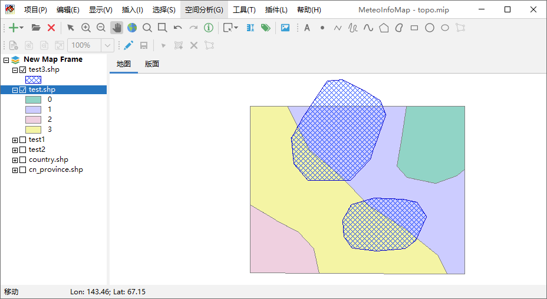

.. docs-meteoinfo-desktop_cn-spatial_analysis-symmetrical_difference:

************************
对称差值分析
************************

对称差值分析（Symmetrical Difference）是指通过重叠处理获得两个图层叠加后去掉公共部分的区域。点击“空间分析 -> 对称
差值”菜单打开对称差值分析对话框，选择操作对象图层（Subject layer）和用做对称差值分析的图层
（Symmetrical Difference layer），点击Apply按钮生成一个新的对称差值多边形图层（SymDifference_test.shp）。

